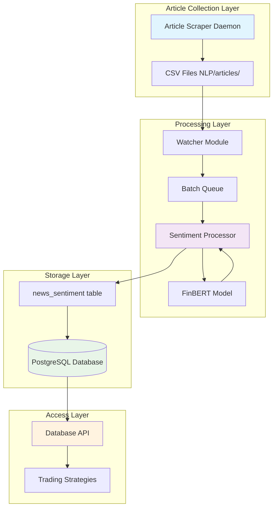
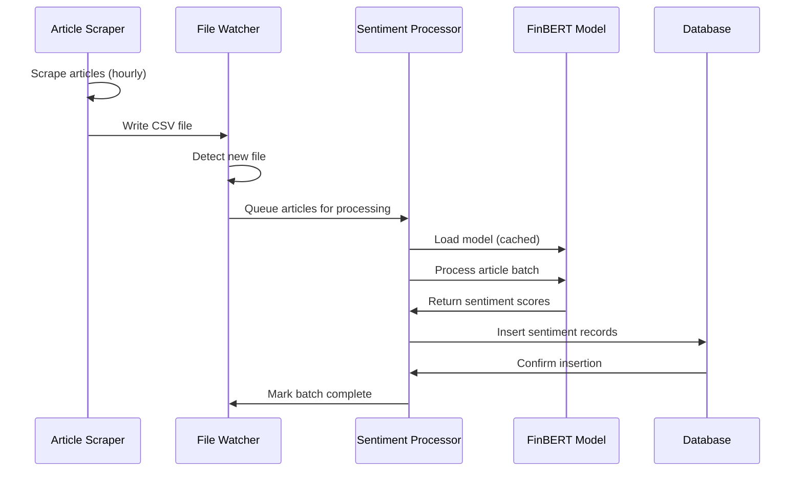
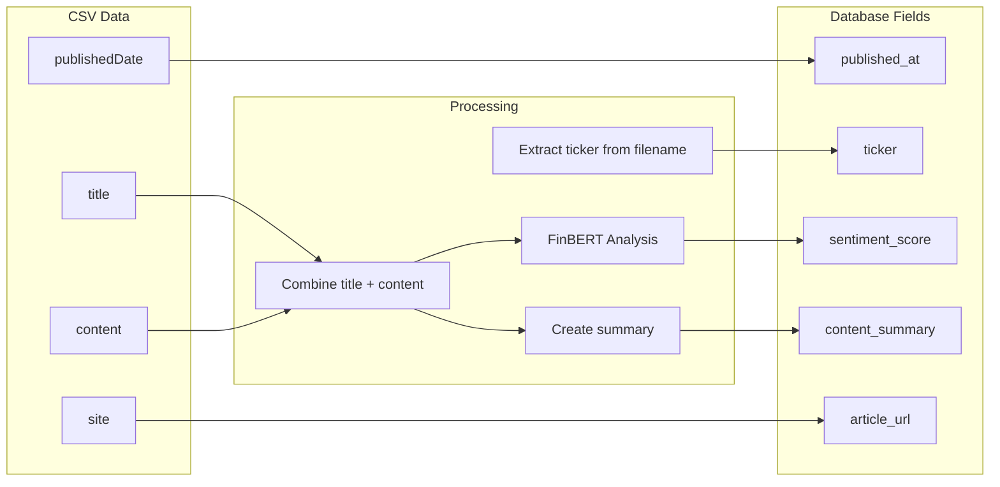

# NLP Database Integration Design

## Overview

This design document outlines the integration of the existing NLP sentiment analysis pipeline with the MQS database system. The integration transforms the current CSV-based workflow into a real-time database-driven system that enables trading strategies to access sentiment data efficiently.

### Current State
- **Article Collection**: 24/7 scraping daemon (`run_scraper.py`) saves articles to CSV files in `NLP/articles/`
- **Sentiment Analysis**: FinBERT model processes articles in Jupyter notebooks
- **Output Storage**: Sentiment scores saved to CSV files in `NLP/sentiment_scores/`
- **Database**: `news_sentiment` table exists but is not populated

### Target State
- **Real-time Processing**: Articles trigger automatic sentiment analysis upon scraping
- **Database Storage**: Sentiment scores stored directly in `news_sentiment` table
- **API Access**: Trading strategies query sentiment data via database connections
- **Historical Migration**: Existing CSV data migrated to database

## Architecture

### High-Level Architecture



### Component Interaction Flow



## Components and Interfaces

### 1. File Watcher Module (`nlp_watcher.py`)

**Purpose**: Monitor `NLP/articles/` directory for new CSV files and trigger processing

**Key Responsibilities**:
- Watch for new CSV files using filesystem events
- Parse CSV files to extract article data
- Queue articles for sentiment processing
- Handle file locking and concurrent access

**Interface**:
```python
class ArticleWatcher:
    def __init__(self, watch_dir: str, processor: SentimentProcessor)
    def start_watching(self) -> None
    def stop_watching(self) -> None
    def process_existing_files(self) -> None
    def _handle_new_file(self, file_path: str) -> None
```

**Configuration**:
- Watch directory: `NLP/articles/`
- File pattern: `*.csv`
- Processing delay: 5 seconds (allow file write completion)
- Batch size: 50 articles per processing batch

### 2. Sentiment Processor (`sentiment_processor.py`)

**Purpose**: Core processing engine that coordinates FinBERT analysis and database storage

**Key Responsibilities**:
- Load and cache FinBERT model
- Process article batches for sentiment analysis
- Validate sentiment scores and article data
- Insert processed data into database
- Handle processing errors and retries

**Interface**:
```python
class SentimentProcessor:
    def __init__(self, model_path: str, db_config: DatabaseConfig)
    def process_articles(self, articles: List[ArticleData]) -> ProcessingResult
    def _load_model(self) -> None
    def _analyze_sentiment(self, text: str) -> float
    def _validate_article(self, article: ArticleData) -> bool
    def _store_sentiment(self, sentiment_data: SentimentData) -> bool
```

**Processing Pipeline**:
1. Validate article data (required fields, content length)
2. Combine title and content for analysis
3. Run FinBERT sentiment analysis
4. Validate sentiment score (-1.0 to 1.0 range)
5. Create content summary (first 500 characters)
6. Insert into database with duplicate prevention

### 3. Database Manager (`db_manager.py`)

**Purpose**: Handle all database operations with connection pooling and error handling

**Key Responsibilities**:
- Manage database connections and connection pooling
- Execute sentiment data insertions with duplicate prevention
- Provide query interface for sentiment data retrieval
- Handle database errors and connection failures

**Interface**:
```python
class DatabaseManager:
    def __init__(self, db_config: DatabaseConfig)
    def insert_sentiment(self, sentiment_data: SentimentData) -> bool
    def get_sentiment_by_ticker(self, ticker: str, start_date: datetime, end_date: datetime) -> List[SentimentData]
    def check_article_exists(self, article_url: str) -> bool
    def get_connection(self) -> Connection
    def close_connections(self) -> None
```

**Database Schema Mapping**:
```python
# CSV to Database field mapping
CSV_TO_DB_MAPPING = {
    'publishedDate': 'published_at',
    'title': 'title',  # Used for sentiment analysis
    'content': 'content',  # Used for sentiment analysis  
    'site': 'article_url',
    # Derived fields
    'ticker': 'ticker',  # Extracted from filename
    'sentiment_score': 'sentiment_score',  # From FinBERT
    'content_summary': 'content_summary'  # First 500 chars
}
```

### 4. Migration Tool (`migrate_csv_data.py`)

**Purpose**: One-time migration of existing CSV sentiment data to database

**Key Responsibilities**:
- Scan existing CSV files in `NLP/sentiment_scores/`
- Parse and validate historical sentiment data
- Bulk insert into database with duplicate prevention
- Generate migration report and validation

**Interface**:
```python
class CSVMigrator:
    def __init__(self, csv_dir: str, db_manager: DatabaseManager)
    def migrate_all_files(self) -> MigrationReport
    def migrate_file(self, file_path: str) -> FileResult
    def validate_migration(self) -> ValidationReport
    def rollback_migration(self, migration_id: str) -> bool
```

### 5. Configuration Manager (`config.py`)

**Purpose**: Centralized configuration management for all components

**Configuration Structure**:
```python
@dataclass
class NLPConfig:
    # File watching
    watch_directory: str = "NLP/articles/"
    processing_delay: int = 5
    batch_size: int = 50
    
    # Model configuration
    model_name: str = "ProsusAI/finbert"
    model_cache_dir: str = "NLP/models/"
    max_sequence_length: int = 512
    
    # Database configuration
    db_host: str = "localhost"
    db_port: int = 5432
    db_name: str = "mqs_database"
    db_user: str = "mqs_user"
    connection_pool_size: int = 10
    
    # Processing configuration
    max_retries: int = 3
    retry_delay: int = 60
    content_summary_length: int = 500
```

## Data Models

### Article Data Structure

```python
@dataclass
class ArticleData:
    ticker: str
    published_date: datetime
    title: str
    content: str
    article_url: str
    
    def __post_init__(self):
        # Validation
        if not self.ticker or len(self.ticker) > 10:
            raise ValueError("Invalid ticker")
        if not self.article_url:
            raise ValueError("Article URL required")
        if not self.title and not self.content:
            raise ValueError("Title or content required")
```

### Sentiment Data Structure

```python
@dataclass
class SentimentData:
    ticker: str
    article_url: str
    published_at: datetime
    sentiment_score: float
    content_summary: str
    
    def __post_init__(self):
        # Validation
        if not -1.0 <= self.sentiment_score <= 1.0:
            raise ValueError("Sentiment score must be between -1.0 and 1.0")
        if len(self.content_summary) > 1000:
            self.content_summary = self.content_summary[:1000]
```

### Database Schema Validation

The existing `news_sentiment` table schema aligns well with our requirements:

```sql
CREATE TABLE news_sentiment (
    id SERIAL PRIMARY KEY,
    ticker VARCHAR(10),           -- Maps to ticker from filename
    article_url TEXT,             -- Maps to 'site' field in CSV
    published_at TIMESTAMP,       -- Maps to 'publishedDate' field
    sentiment_score FLOAT,        -- Generated by FinBERT (-1.0 to 1.0)
    content_summary TEXT          -- First 500 chars of content
);
```

**Required Indexes** (to be added):
```sql
CREATE INDEX idx_news_sentiment_ticker_date ON news_sentiment(ticker, published_at);
CREATE INDEX idx_news_sentiment_published_at ON news_sentiment(published_at);
CREATE UNIQUE INDEX idx_news_sentiment_url ON news_sentiment(article_url);
```

## Data Flow

### Real-time Processing Flow

1. **Article Collection**: Scraper daemon writes new articles to `NLP/articles/{TICKER}.csv`
2. **File Detection**: Watcher detects new/modified CSV files
3. **Article Parsing**: Extract articles from CSV, validate data structure
4. **Batch Processing**: Group articles into batches for efficient processing
5. **Sentiment Analysis**: FinBERT processes article title + content
6. **Data Validation**: Validate sentiment scores and article data
7. **Database Storage**: Insert sentiment data with duplicate prevention
8. **Error Handling**: Log failures, retry with exponential backoff

### Data Transformation Pipeline



### Historical Data Migration Flow

1. **Discovery**: Scan `NLP/sentiment_scores/` for existing CSV files
2. **Validation**: Verify CSV structure and data quality
3. **Transformation**: Map CSV fields to database schema
4. **Deduplication**: Check for existing records using article_url
5. **Bulk Insert**: Efficient batch insertion with transaction management
6. **Verification**: Validate migration completeness and data integrity

## Correctness Properties

*A property is a characteristic or behavior that should hold true across all valid executions of a system—essentially, a formal statement about what the system should do. Properties serve as the bridge between human-readable specifications and machine-verifiable correctness guarantees.*

Based on the prework analysis, here are the testable correctness properties:

### Property 1: Database Schema Compatibility
*For any* valid article data from the NLP pipeline, all required fields should be successfully insertable into the news_sentiment table without schema violations
**Validates: Requirements 1.1, 1.2**

### Property 2: Sentiment Score Range Validation  
*For any* sentiment score generated by FinBERT, the value should be within the range -1.0 to 1.0 and be accurately stored and retrieved from the database
**Validates: Requirements 1.3**

### Property 3: File Watcher Trigger Consistency
*For any* new CSV file created in the articles directory, the file watcher should detect it and trigger sentiment processing
**Validates: Requirements 2.1**

### Property 4: FinBERT Processing Validity
*For any* valid article content and title, FinBERT should produce a sentiment score within the expected range (-1.0 to 1.0)
**Validates: Requirements 2.2**

### Property 5: Complete Field Population
*For any* sentiment data insertion, all required database fields (ticker, article_url, published_at, sentiment_score, content_summary) should be populated
**Validates: Requirements 3.1**

### Property 6: Connection Failure Recovery
*For any* database connection failure during processing, the retry mechanism should eventually succeed or fail gracefully without data loss
**Validates: Requirements 3.2**

### Property 7: Duplicate Prevention
*For any* article URL, attempting to insert sentiment data multiple times should result in only one record in the database
**Validates: Requirements 3.3**

### Property 8: Transaction Atomicity
*For any* database write operation, either all fields are successfully inserted or none are, maintaining data consistency
**Validates: Requirements 3.4**

### Property 9: Content Summary Generation
*For any* article content, the generated content_summary should contain the first N characters (up to 500) of the original content
**Validates: Requirements 3.5**

### Property 10: Migration Completeness
*For any* set of CSV sentiment files, the migration process should import all valid records to the database
**Validates: Requirements 4.1**

### Property 11: Migration Data Integrity
*For any* CSV record successfully migrated, the database record should contain identical data values
**Validates: Requirements 4.2**

### Property 12: Migration Idempotence
*For any* migration operation, running it multiple times should produce the same final database state
**Validates: Requirements 4.3**

### Property 13: Backup Preservation
*For any* successful migration, the original CSV files should remain unchanged in their original location
**Validates: Requirements 4.4**

### Property 14: Aggregation Query Correctness
*For any* set of sentiment records with timestamps, aggregation queries should produce mathematically correct results (averages, counts, etc.)
**Validates: Requirements 5.2**

### Property 15: API Data Consistency
*For any* query to the sentiment API, the returned data should match exactly what exists in the database for those criteria
**Validates: Requirements 5.3**

### Property 16: Content Summary Utility
*For any* content summary in the database, it should contain meaningful text from the original article content
**Validates: Requirements 5.5**

<function_calls>
<invoke name="prework">
<parameter name="featureName">nlp-db-integration

## Error Handling

### File Processing Errors

**Article Parsing Failures**:
- **Cause**: Malformed CSV files, missing required fields
- **Handling**: Log error, skip invalid records, continue processing valid records
- **Recovery**: Manual intervention to fix CSV format, reprocess file

**Model Loading Failures**:
- **Cause**: Missing model files, insufficient memory, CUDA errors
- **Handling**: Fallback to CPU processing, retry with exponential backoff
- **Recovery**: Cache model on first successful load, validate model integrity

### Database Errors

**Connection Failures**:
- **Cause**: Network issues, database downtime, connection pool exhaustion
- **Handling**: Retry with exponential backoff (max 3 attempts), queue failed operations
- **Recovery**: Implement circuit breaker pattern, local caching for temporary failures

**Schema Violations**:
- **Cause**: Data type mismatches, constraint violations, field length exceeded
- **Handling**: Validate data before insertion, truncate content_summary if needed
- **Recovery**: Log validation errors, provide data correction suggestions

**Duplicate Key Violations**:
- **Cause**: Attempting to insert existing article_url
- **Handling**: Check for existing records before insertion, update if needed
- **Recovery**: Implement upsert logic for handling duplicates gracefully

### Processing Pipeline Errors

**Sentiment Analysis Failures**:
- **Cause**: Invalid input text, model inference errors, memory issues
- **Handling**: Skip problematic articles, log detailed error information
- **Recovery**: Implement fallback sentiment scoring, manual review queue

**Batch Processing Failures**:
- **Cause**: Partial batch failures, resource exhaustion
- **Handling**: Process articles individually on batch failure, maintain progress tracking
- **Recovery**: Resume from last successful article, avoid reprocessing completed items

### Monitoring and Alerting

**Health Checks**:
- File watcher process status
- Database connection health
- Model loading status
- Processing queue depth

**Alert Conditions**:
- Processing delays > 5 minutes
- Database connection failures > 3 consecutive attempts
- Model inference errors > 10% of articles
- Disk space < 1GB in NLP directories

## Testing Strategy

### Dual Testing Approach

The testing strategy employs both unit tests and property-based tests to ensure comprehensive coverage:

**Unit Tests**: Focus on specific examples, edge cases, and error conditions
- Test specific CSV parsing scenarios
- Validate database connection handling
- Test model loading and inference
- Verify error handling paths

**Property-Based Tests**: Verify universal properties across all inputs
- Generate random article data to test schema compatibility
- Test sentiment score range validation with random inputs
- Verify duplicate prevention with random article URLs
- Test migration idempotence with random CSV datasets

### Property-Based Testing Configuration

**Testing Framework**: Use `hypothesis` for Python property-based testing
**Test Configuration**: Minimum 100 iterations per property test
**Test Tagging**: Each property test references its design document property

Example test structure:
```python
@given(article_data=article_strategy())
def test_database_schema_compatibility(article_data):
    """
    Feature: nlp-db-integration, Property 1: Database Schema Compatibility
    """
    # Test implementation
```

### Integration Testing

**End-to-End Pipeline Tests**:
- Create test CSV files with known article data
- Verify complete pipeline from file detection to database storage
- Validate data transformation accuracy
- Test error recovery scenarios

**Database Integration Tests**:
- Test with actual PostgreSQL database
- Verify index performance with large datasets
- Test concurrent access scenarios
- Validate transaction isolation

### Performance Testing

**Load Testing**:
- Process 1000+ articles simultaneously
- Measure processing throughput and latency
- Test database connection pool under load
- Verify memory usage stability

**Stress Testing**:
- Test with malformed CSV files
- Simulate database connection failures
- Test with extremely large article content
- Verify graceful degradation under resource constraints

### Test Data Management

**Synthetic Data Generation**:
- Generate realistic article content for testing
- Create various CSV file formats and structures
- Generate edge cases (empty content, special characters)
- Create large datasets for performance testing

**Test Environment**:
- Isolated test database with same schema as production
- Mock FinBERT model for fast testing
- Configurable test data directories
- Automated test data cleanup

## Implementation Notes

### Technology Stack

**Core Technologies**:
- **Python 3.9+**: Main implementation language
- **PostgreSQL**: Database system
- **Transformers Library**: FinBERT model integration
- **Watchdog**: File system monitoring
- **SQLAlchemy**: Database ORM and connection management
- **Pandas**: CSV processing and data manipulation

**Development Dependencies**:
- **pytest**: Unit testing framework
- **hypothesis**: Property-based testing
- **pytest-asyncio**: Async testing support
- **black**: Code formatting
- **mypy**: Type checking

### Deployment Considerations

**Environment Configuration**:
- Separate configuration files for development, testing, and production
- Environment variable support for sensitive configuration
- Docker containerization for consistent deployment
- Health check endpoints for monitoring

**Resource Requirements**:
- **Memory**: 4GB minimum (2GB for FinBERT model, 2GB for processing)
- **Storage**: 10GB for model cache and temporary processing
- **CPU**: Multi-core recommended for batch processing
- **GPU**: Optional but recommended for faster FinBERT inference

**Monitoring Integration**:
- Structured logging with JSON format
- Metrics collection for processing rates and error counts
- Integration with existing monitoring infrastructure
- Dashboard for real-time pipeline status

### Security Considerations

**Database Security**:
- Use connection pooling with proper authentication
- Implement SQL injection prevention
- Encrypt database connections (SSL/TLS)
- Regular security updates for database drivers

**File System Security**:
- Validate file paths to prevent directory traversal
- Implement proper file permissions
- Monitor for suspicious file system activity
- Regular cleanup of temporary files

**Model Security**:
- Verify model file integrity
- Secure model storage and access
- Monitor for model tampering
- Regular model updates and security patches

This design provides a robust foundation for integrating the NLP sentiment analysis pipeline with the database system, ensuring reliable real-time processing while maintaining data integrity and system performance.