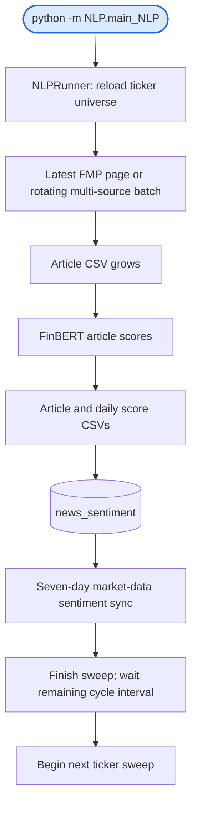

# NLP: setup, commands, and local experiments

[Repository setup for Windows/macOS](../README.md) · [High-level diagram](../docs/workflows/nlp_workflow.md) · [Detailed workflow diagrams](WORKFLOW.md)

Use the shared MQS virtual environment, requirements, and explicit NLP dependencies from the root setup. The fetch-only CLI and local notebook do not need PostgreSQL; the continuous and historical scoring pipelines do.

## Local two-model experiment (Windows)

From the repository root, activate the existing environment and download articles:

```powershell
. .\MQS\Scripts\Activate.ps1

# One year for one ticker, or several comma-separated tickers:
python -m NLP.fetch_articles AAPL 2025-09-30 2026-09-30 --restart
python -m NLP.fetch_articles AAPL,MSFT,GOOGL 2025-09-30 2026-09-30 --restart

# All FMP pages in the date window, without the optional alternative sources:
python -m NLP.fetch_articles AAPL,MSFT 2025-09-30 2026-09-30 --fmp-only --restart

# Rolling last year, calculated when you run the command:
$newsEnd = Get-Date -Format yyyy-MM-dd
$newsStart = (Get-Date).AddYears(-1).ToString('yyyy-MM-dd')
python -m NLP.fetch_articles AAPL,MSFT $newsStart $newsEnd --restart
```

`ALL` can replace the ticker list to use `src/orchestrator/backfill/tickers.json`.
The script prints progress per ticker and saves merged CSVs to `NLP/articles/`,
regardless of the terminal's current directory. Direct invocation also works:
`python NLP/fetch_articles.py AAPL 2025-09-30 2026-09-30 --restart`.
`--restart` begins pagination at page zero while retaining and deduplicating
existing articles. Omit it to resume saved pagination after an interruption.
FMP pages are fetched until the requested start date or the end of available
results, not only the first news page. Provider coverage still applies;
Yahoo/Finviz expose recent feeds, and Alpha Vantage is skipped if `ALPHA_KEY`
is missing. FMP HTTP failures exit unsuccessfully instead of claiming a complete fetch.
Blocked optional sources are named in a warning; available sources are still merged.
Article text is whatever each provider supplies; it is not guaranteed to be the
full text of every publisher's article. This command does not score or write to a database.

Place the two downloaded model folders here (files directly inside each folder,
without an extra nested model directory):

```text
NLP/finbert-combined-final/{config.json,model.safetensors,tokenizer.json,...}
NLP/finbert-finetuned-final/{config.json,model.safetensors,tokenizer.json,...}
```

Open `NLP/visualise_NLP.ipynb` and select **MQS (NLP local)**. To register that
kernel on another machine: `python -m ipykernel install --user --name mqs-nlp --display-name "MQS (NLP local)"`.
Edit `TICKERS`, `START_DATE`, `END_DATE`, `MODELS_TO_RUN`, and `ACTIVE_MODEL` in
the first code cell, then run the cells in order. Start Jupyter from the repo
root or `NLP/`; paths are resolved from the repository and `.env` is loaded there.

Both models score the same selected article set, using their own label mappings.
Each scoring run recomputes that selection, keeps article identity beside its
score, and writes to separate directories:

- `NLP/sentiment_scores/combined/`
- `NLP/sentiment_scores/finetuned/`

The comparison cell overlays both models. Existing individual-model plots use
`ACTIVE_MODEL`; change it and rerun the plot cells to switch models. Price CSVs
go to `NLP/stock_price/`, and CAPM CSVs to `NLP/CAPM/`. Prices are daily, with
extra history for the rolling beta warmup. The notebook uses a simple daily
mean sentiment, distinct from the production weighted mean. It writes only
local files and does not require PostgreSQL. The model weights and generated
CSVs are excluded from Git.

## Setup: Download the FinBERT Model

The production scorer requires the team's fine-tuned model. It is not committed to Git.

1. Download the model folder from the [existing team model link](https://drive.google.com/drive/folders/1v7NjSuyFq4CTIctrw1bSv13JzkkMg1l8?usp=sharing).
2. Place the contents directly in `NLP/finbert-combined-final/` (no extra nested directory).
3. Check for `config.json`, model weights, and tokenizer files.

The default path comes from [core/paths.py](core/paths.py). A missing folder raises `FileNotFoundError`; there is no automatic Hugging Face fallback. The production [scorer](sentiment/scorer.py) computes probability index 0 minus index 2 and expects positive/neutral/negative labels at 0/1/2. Its fixed mapping differs from the notebook's per-model label handling.

On Windows, activate with `. .\MQS\Scripts\Activate.ps1`. On macOS, use `source MQS/bin/activate`. Run all commands below from the repository root. For DB-backed modes, complete the [database setup](../README.md#3-configure-credentials-and-initialize-the-database), including the `market_data.sentiment_score` column prerequisite.

## Run the pipeline

```bash
# Continuous in-process loop: load model once, then fetch, score, persist
python -m NLP.main_NLP

# Historical fetch + score + persistence (ISO dates)
python -m NLP.backfill_NLP --start 2025-01-01 --end 2025-12-31 --tickers AAPL MSFT

# Wait for weekday cash-session close if the backfill guard is active
python -m NLP.backfill_NLP --start 2025-01-01 --end 2025-12-31 --tickers AAPL MSFT --wait
```

Choose the command for the desired mode; the continuous command occupies its terminal until stopped. Backfill's time-of-day guard has no holiday calendar. When launched independently, stop the live runner with Ctrl+C. The `start.sh` persistent watcher will restart its child after any exit, even after market close; see the [launcher lifecycle](../docs/workflows/live_trading_workflow.md).

### Individual stages and monitoring

```bash
# Fetch articles only: no model or database
python -m NLP.fetch_articles AAPL,MSFT 2025-01-01 2025-12-31 --fmp-only --restart

# Score existing article CSVs and persist to PostgreSQL
python -m NLP.process_sentiment_pipeline AAPL MSFT

# Query persisted news sentiment
python -m NLP.update_database --query AAPL MSFT

# Report runner/log health
python -m NLP.monitor_daemon --synthetic --max-log-age-hours 72
```

`fetch_articles --fmp-only` fetches the requested date range with pagination. `--restart` resets pagination while retaining/deduplicating existing articles; omit it to resume. Optional providers may supply only recent coverage. Alpha Vantage is skipped when `ALPHA_KEY` is unset. Truth Social needs `APIFY_KEY` and explicit opt-in through the historical pipeline's `--include-trump-tracker`.

## Workflow at a glance



The target interval is 300 seconds, including work. Tickers run sequentially in up to four batches; one batch uses alternative sources each cycle. A slow sweep exceeds five minutes. NLP does not execute trades; sentiment-aware portfolios must be explicitly selected.

See [WORKFLOW.md](WORKFLOW.md) for the detailed live/backfill diagrams, fixed model-label mapping, positional CSV alignment limitations, weighted scoring formula, database contracts, and retry behavior.

## Files and source map

| Location | Purpose |
|---|---|
| `main_NLP.py`, `runner.py` | Live entrypoint and orchestration |
| `backfill_NLP.py` | Historical workflow and session guard |
| `fetch_articles.py` | Manual fetch CLI, including restart and FMP-only modes |
| `scrapers/` | FMP, Yahoo, Finviz, Alpha Vantage, optional Truth Social, aggregator |
| `sentiment/scorer.py` | Model loading, inference, score CSVs |
| `sentiment/pipeline.py` | Score then persist a ticker |
| `persistence/repository.py` | News inserts and market sentiment sync |
| `orchestration/ticker_universe.py` | Universe loading and batch construction |
| `articles/`, `sentiment_scores/`, `fetch_state/` | Local data and pagination state |
| `finbert-combined-final/` | Downloaded production model |
| `visualise_NLP.ipynb` | Local two-model comparison |
| `../logs/daemon.log` | Runner progress and errors |

The ticker universe is `src/orchestrator/backfill/tickers.json` with `^VIX` excluded by default. FMP rate-limit settings are process-local budgets, not proof of account-wide quota or coverage. Check row contents and sync warnings separately from the pipeline's success message.
