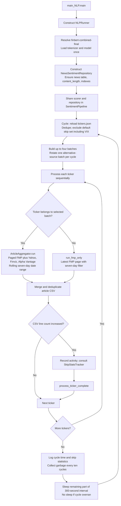
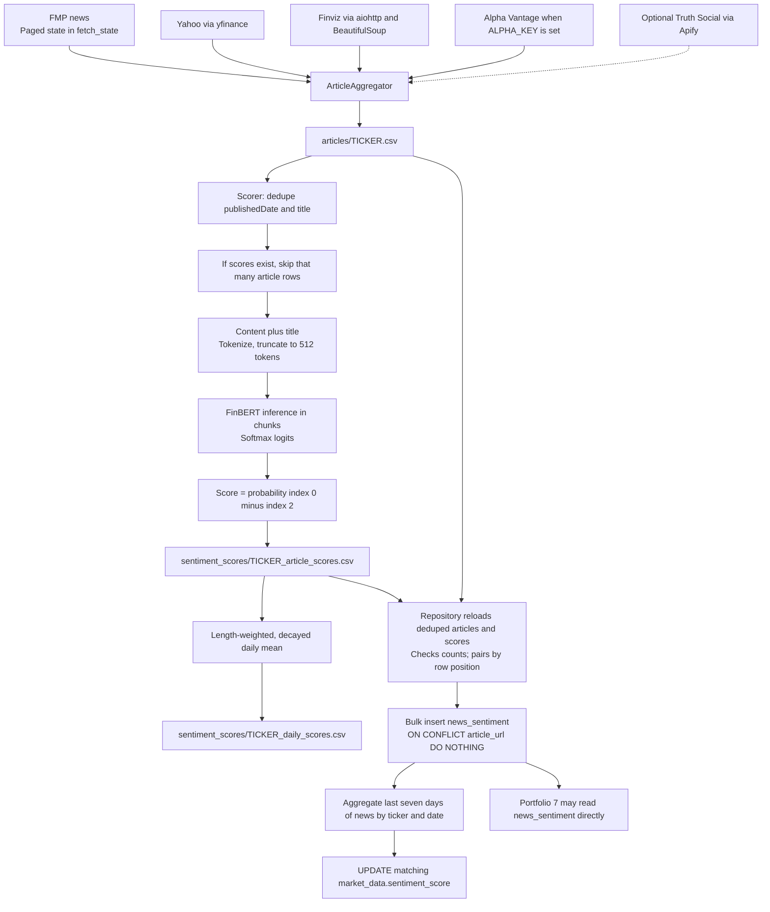
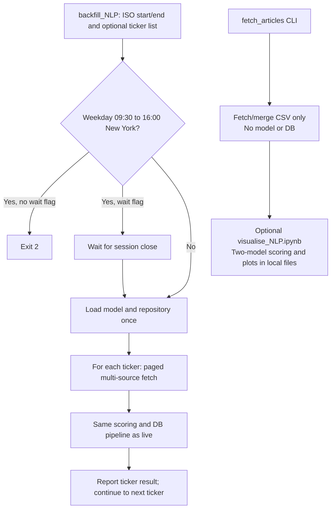

# NLP: detailed workflow

[Setup and commands](README.md) · [High-level diagram](../docs/workflows/nlp_workflow.md) · [Repository setup](../README.md)

The live entrypoint is [main_NLP.py](main_NLP.py). [runner.py](runner.py) owns the continuous loop; scraping, scoring, and persistence happen in the same process. The local notebook experiment described in the README is a separate, file-only workflow.

## Live startup and batch rotation



A failed fetch records inactivity and skips that ticker. A scoring/persistence error is logged; later tickers still run. Unexpected outer-loop exceptions wait 60 seconds before retrying. Four batches do not imply four parallel workers: processing is serial. A full sweep can exceed five minutes, so alternative-source coverage every four cycles is not a guaranteed 20-minute schedule.

The new-row signal counts physical CSV lines, not parsed records or article identities. `SkipStatsTracker` consults the last five observations after recording the current fetch; with default settings a new article normally prevents that additional skip. Already-scored tickers with no CSV growth do not re-enter persistence merely to retry a previous DB failure.

## Fetch, model inference, and storage



Truth Social is opt-in (for example `backfill_NLP --include-trump-tracker`); it is not part of the default live rotation. FMP pagination lives in [scrapers/fmp.py](scrapers/fmp.py); [scrapers/aggregator.py](scrapers/aggregator.py) merges provider results. Optional provider failures can leave a partial source set, so a saved CSV does not imply complete historical coverage.

The production scorer [sentiment/scorer.py](sentiment/scorer.py) uses fixed indices **0 = positive, 2 = negative**, with index 1 neutral, and computes `probs[:, 0] - probs[:, 2]`. It does not dynamically remap arbitrary model labels. Use the expected fine-tuned model, not an unrelated replacement. The notebook's two-model label handling is separate.

### Incremental identity limitation

The production scorer resumes by **row count**, and the repository pairs scores to articles by **position**. Equal counts do not prove article identities match after sorting, backfilling older articles, editing a CSV, or skipping a failed model chunk. Preserve matched article/score files when resuming; do not interpret these mechanics as an identity-safe incremental join. The notebook comparison recomputes its selected article set and keeps identities separately.

## Daily score and database contract

For each article, the normal CSV path calculates:

```text
score = P(positive) - P(negative)
weight = word_count(content + title) * 0.5 ** (age_seconds / 23400)
daily_score = sum(score * weight) / sum(weight)
```

The half-life is 6.5 hours. Legacy score CSVs without weight columns fall back to an arithmetic daily mean. The DB calculation uses `COALESCE(content_length, 100)` and the same half-life.

For a fixed set of articles, advancing the clock multiplies every weight by the same factor, which cancels in the normalized mean (apart from numerical effects). Scores can change when the article set or the rolling cutoff changes. The SQL sync considers only news published within the last **seven days**, with a no-op guard of `ABS(old - new) > 0.0001`; it does not rewrite all historical dates. Old news can still be inserted into `news_sentiment` by backfill without filling old `market_data` sentiment.

### Database contract

| Destination | Contract |
|---|---|
| `news_sentiment` | ticker, URL, publication time, score, summary (up to 1000 characters), full-text word count |
| Article uniqueness | Unique `article_url` across the entire table, not ticker plus URL; a shared URL does not get a second ticker row |
| Repository initialization | Creates table/indexes if needed and adds `content_length` when missing; inspect logged DDL failures |
| `market_data` sync | Requires `sentiment_score`; base `SchemaDefinitions` instead creates `avg_sentiment` |
| Portfolio 7 fallback | Its market-data query references both sentiment columns; keep the distinction visible when preparing a database |

For a fresh development database, follow the [root setup's explicit column prerequisite](../README.md#3-configure-credentials-and-initialize-the-database). Table bootstrap alone does not satisfy the writer contract.

The sentiment sync retries up to five times, then logs failure without raising it to the caller. The repository also reads `rowcount` for its inserted statistic while the shared bulk connector reports `inserted_count`; a false pipeline result can therefore coexist with a successful insert. Verify the actual ticker rows and sync logs, not only the final success boolean. No runtime code is changed by this guide.

## Historical and local modes



The backfill hours helper in [src/common/market_hours.py](../src/common/market_hours.py) checks weekdays and time of day, with no holiday calendar. It runs before the backfill starts, not before every ticker. The live runner has no market-hours block.

Manual fetch supports comma-separated tickers or `ALL`, ISO dates, `--fmp-only`, and `--restart`. Its `--fmp-only` mode paginates the requested date range; do not confuse it with the runner's latest-page `run_fmp_only` method.

## Files, limits, and monitoring

| Resource | Location / behavior |
|---|---|
| Universe | `src/orchestrator/backfill/tickers.json`, reloaded each live cycle |
| Model | `NLP/finbert-combined-final/`; missing folder fails startup |
| Articles | `NLP/articles/<TICKER>.csv` |
| Pagination state | `NLP/fetch_state/<TICKER>_state.json` |
| Score outputs | `NLP/sentiment_scores/<TICKER>_article_scores.csv` and `_daily_scores.csv` |
| Runner log | `logs/daemon.log`, 10 MB rotation with one backup |
| Launcher log | `logs/main_NLP.watcher.log` when started by `start.sh` |

The code budgets FMP calls at 2000/minute for NLP and 1000/minute for realtime via [fmp_rate_limiter.py](../src/common/fmp_rate_limiter.py). These are process-local limiters, not a distributed account quota; starting multiple NLP processes adds separate budgets. Provider entitlements and current throttling must be checked independently.

```bash
python -m NLP.monitor_daemon
python -m NLP.monitor_daemon --synthetic --max-log-age-hours 72
python -m NLP.update_database --query AAPL MSFT
```

Monitoring reports process and log signals, not proof of current provider coverage or correct DB writes. Foreground `main_NLP` stops with Ctrl+C; when launched through `start.sh`, its persistent watcher restarts the worker after any exit and remains independent of market-close shutdown.
