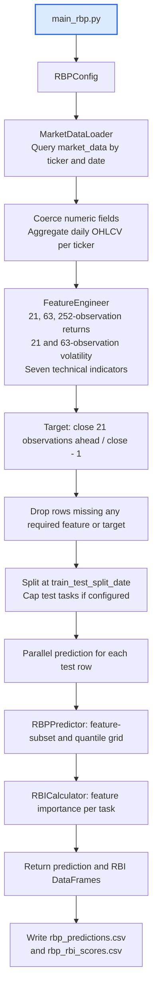
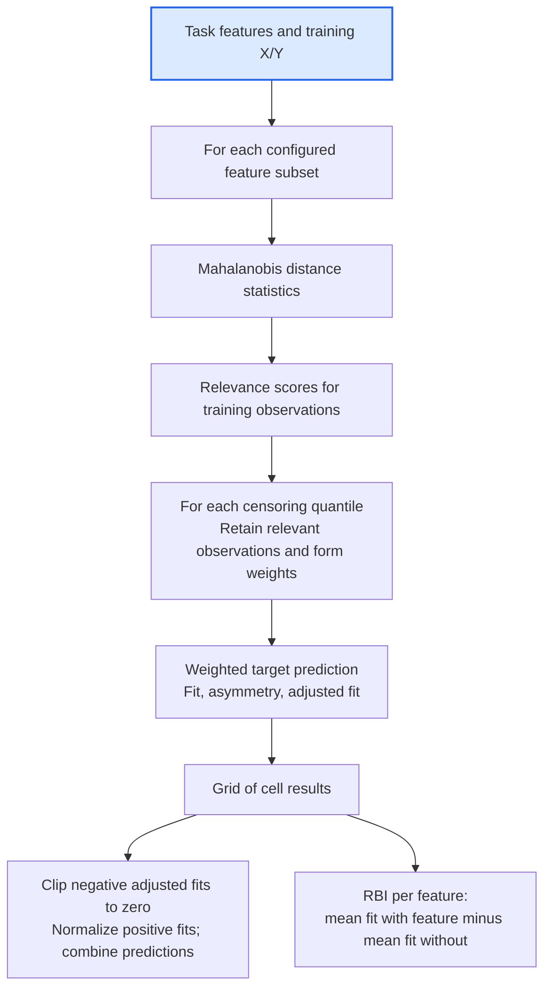
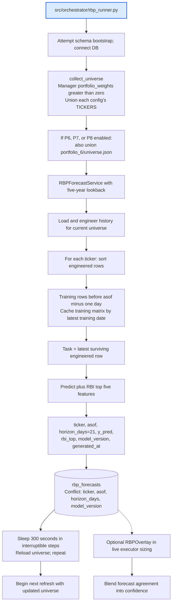

# Relevance-Based Prediction (RBP)

RBP compares a prediction task with historical observations, forms relevance-weighted predictions over feature subsets and censoring thresholds, and combines them by adjusted fit. RBI (relevance-based importance) summarizes how including each feature changes that fit.

[Repository setup](../README.md) · [Portfolio integrations](../src/portfolios/README.md) · [Live stack](../docs/workflows/live_trading_workflow.md)

## Setup and commands

Use the shared Windows/macOS venv and requirements from the root README. Run from the repository root. Configure the PostgreSQL variables in `.env`, create tables, and backfill the selected tickers. RBP reads `market_data`; it does not download prices itself or require a pretrained model file.

The longest feature needs 252 daily observations; the target needs another 21 future observations, with usable rows on both sides of the research split. A short recent backfill will produce no usable experiment. The loader defaults to daily aggregation of intraday rows; quote-only data with NULL high/low/open is not equivalent to complete historical OHLCV.

```bash
# One research experiment; exports two CSVs
python -m RBP.main_rbp

# Continuous forecasts written to PostgreSQL
python -m src.orchestrator.rbp_runner
```

The research CLI reads [config.py](config.py); it has no argument parser. Change the dataclass defaults or instantiate `RBPConfig` from your own Python entrypoint. It writes `rbp_predictions.csv` and `rbp_rbi_scores.csv` in the current working directory. Stop the continuous runner with Ctrl+C.

| Research setting | Checked-in default |
|---|---|
| Tickers | AAPL, TSLA, AMD, MSFT, NVDA |
| History | Five calendar years backward from execution time |
| Train/test split | 2023-01-01 |
| Features | Five return/volatility features plus SMA, RSI, RMI, ROC, ATR, DMA, VWAP |
| Target | `target_return_21d` |
| Maximum feature subset | 1 feature |
| Censoring quantiles | 0.0, 0.2, 0.5, 0.8 |
| Maximum test tasks | 200, deterministic sampled subset |
| Parallelism | `n_jobs=-1`, joblib/loky |

The rolling history start moves as time passes; adjust the fixed split date so training data still exists. The service constructs its own config with a universe from manager weights, so the research default ticker list is not its live universe.

## Research workflow



The loader converts timestamps to UTC and removes the timezone before daily grouping. Its actual grouping is by those normalized dates; do not assume a separate New York exchange-session resampler. Train/test rows from all configured tickers enter the research training matrix together. Empty data, empty splits, or failure of all prediction tasks abort the experiment.

### Prediction internals



If all adjusted fits are zero, the predictor returns 0.0 with an unreliable-prediction warning. Increasing subset size expands the grid combinatorially. Core calculations live in [core/](core/), with prediction and importance in [models/](models/).

## Forecast service and live consumption



The service uses the same feature engineer and predictor as research, but constructs training data per ticker and writes forecasts rather than research CSVs. Conflicts are ignored (`DO NOTHING`), not updated. Per-ticker exceptions are logged and skipped; refresh-level errors are retried next cycle. An empty universe idles and is rechecked. The runner handles SIGINT/SIGTERM and closes its DB pool.

The runner's positive-weight universe is **not** the live strategy class selection. `src/main.py` selects live threads explicitly, whereas the manager weights choose the forecast universe and capital shares. The optional executor overlay reads recent forecasts with a short cache; missing/stale/error results leave the strategy confidence unchanged. The checked-in manager config has no `rbp_overlay` section, so the entrypoint leaves it disabled.

### Current forecast freshness limitation

[FeatureEngineer.engineer](features/engineer.py) drops rows without the forward 21-observation target, including the newest 21 daily rows. [RBPForecastService](service.py) then predicts from the **latest surviving engineered row** and labels the output with the current `asof`. That task can also occur in its training set. Consequently, a fresh `generated_at` is not proof of a fresh, out-of-sample 21-day forecast.

The research split also does not purge training rows whose forward-target windows cross the split. These diagrams describe the implemented algorithm; neither command establishes point-in-time research validity by itself.

## Three distinct portfolio integrations

| Integration | Implementation and behavior |
|---|---|
| Portfolio 5 | [RBPModel](../src/portfolios/portfolio_5/rbp_model.py) is a separate implementation, lazily fitted inside [RBPStrategy](../src/portfolios/portfolio_5/strategy.py); its rolling windows operate on supplied bars |
| Portfolio 8 | [Portfolio8Strategy](../src/portfolios/portfolio_8/strategy.py) calls the research pipeline to blend an RBP rank into P6 screening; failures fall back to P6 |
| Live executor overlay | [RBPOverlay](../src/risk_manager/rbp_overlay.py) reads `rbp_forecasts` produced by this service and blends sizing confidence when enabled |

The current research prediction output lacks a ticker column. P8 therefore takes its fallback branch that assigns the test-window average prediction to each capped ticker; do not describe that path as distinct current per-ticker forecasts.

## Verification and source map

A useful run has nonempty loaded and engineered row counts, a nonempty train/test split (research), and saved CSVs or actual DB forecast rows. Inspect timestamps and the freshness limitation above when interpreting service output. No external API key is needed solely to read previously populated RBP history.

| File | Responsibility |
|---|---|
| [main_rbp.py](main_rbp.py) | Research entrypoint and CSV exports |
| [config.py](config.py) | Experiment defaults |
| [database/loader.py](database/loader.py) | SQL and daily aggregation |
| [features/engineer.py](features/engineer.py) | Features, target, row filtering |
| [pipeline.py](pipeline.py) | Research split and parallel tasks |
| [models/predictor.py](models/predictor.py) | Grid and composite prediction |
| [models/importance.py](models/importance.py) | RBI calculation |
| [service.py](service.py) | Per-ticker forecast generation and persistence |
| [rbp_runner.py](../src/orchestrator/rbp_runner.py) | Continuous orchestration and universe refresh |
