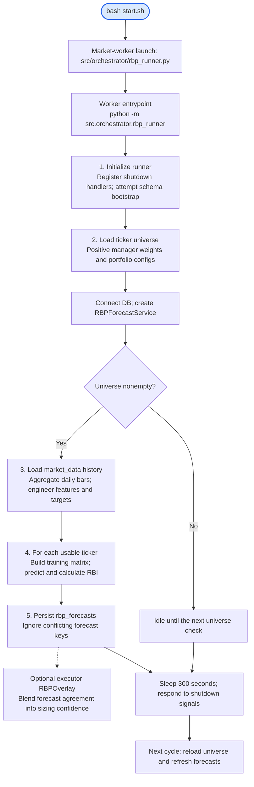
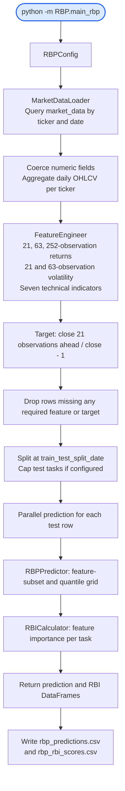
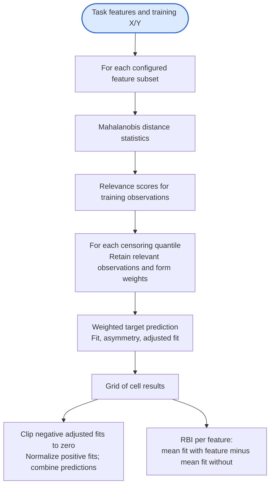
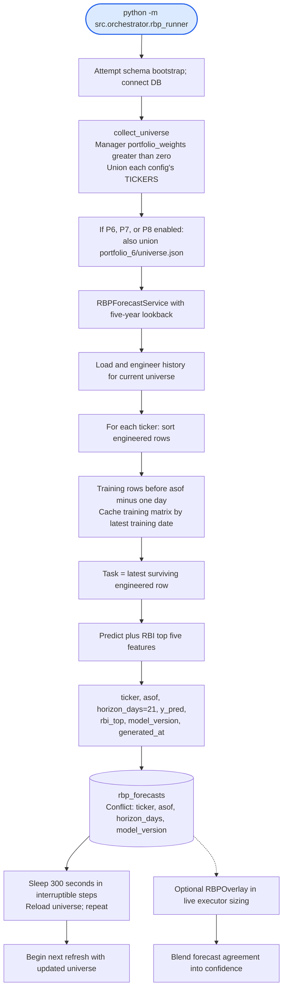

# RBP: detailed workflow

[Setup and commands](README.md) · [NLP workflow](../NLP/WORKFLOW.md) · [Repository setup](../README.md)

RBP has two entrypoints: [rbp_runner.py](../src/orchestrator/rbp_runner.py) continuously refreshes database forecasts for the live stack; [main_rbp.py](main_rbp.py) runs a research experiment and exports CSVs. Both use the feature engineer and relevance-based predictor.

## Live workflow hierarchy

Read from the highlighted root downward: launcher, worker initialization, inputs, processing, storage, and consumers. Each arrow leads to the next stage or a branch within it. Repeated work ends at a next-cycle leaf to keep the hierarchy readable. The worker command can also be run directly from the repository root after activating the venv.

Solid arrows show worker execution; the dashed branch shows a downstream consumer, not another worker step. `start.sh` supervises RBP as a market worker and terminates it when the market watchdog stops the market workers. It does not restart a crashed RBP worker. Direct invocation has no market-hours watchdog. See the [launcher lifecycle](../docs/workflows/live_trading_workflow.md#market-watchdog-and-persistent-worker-lifecycle).

The sections below expand the [research command](#research-workflow), [prediction internals](#prediction-internals), [forecast service](#forecast-service-and-live-consumption), and [portfolio integrations](#three-distinct-portfolio-integrations). Review the [forecast freshness limitation](#current-forecast-freshness-limitation) before interpreting service output.

## Research workflow

The loader converts timestamps to UTC and removes the timezone before daily grouping. Its actual grouping is by those normalized dates; do not assume a separate New York exchange-session resampler. Train/test rows from all configured tickers enter the research training matrix together. Empty data, empty splits, or failure of all prediction tasks abort the experiment.

### Prediction internals

If all adjusted fits are zero, the predictor returns 0.0 with an unreliable-prediction warning. Increasing subset size expands the grid combinatorially. Core calculations live in [core/](core/), with prediction and importance in [models/](models/).

## Forecast service and live consumption

The service uses the same feature engineer and predictor as research, but constructs training data per ticker and writes forecasts rather than research CSVs. Conflicts are ignored (`DO NOTHING`), not updated. Per-ticker exceptions are logged and skipped; refresh-level errors are retried next cycle. An empty universe idles and is rechecked. The runner handles SIGINT/SIGTERM and closes its DB pool.

The runner's positive-weight universe is **not** the live strategy class selection. `src/main.py` selects live threads explicitly, whereas the manager weights choose the forecast universe and capital shares. The optional executor overlay reads recent forecasts with a short cache; missing/stale/error results leave the strategy confidence unchanged. The checked-in manager config has no `rbp_overlay` section, so the entrypoint leaves it disabled.

### Current forecast freshness limitation

[FeatureEngineer.engineer](features/engineer.py) drops rows without the forward 21-observation target, including the newest 21 daily rows. [RBPForecastService](service.py) then predicts from the **latest surviving engineered row** and labels the output with the current `asof`. That task can also occur in its training set. Consequently, a fresh `generated_at` is not proof of a fresh, out-of-sample 21-day forecast.

The research split also does not purge training rows whose forward-target windows cross the split. These diagrams describe the implemented algorithm; neither command establishes point-in-time research validity by itself.

## Three distinct portfolio integrations

| Integration | Implementation and behavior |
|---|---|
| Portfolio 5 | [RBPModel](../src/portfolios/portfolio_5/rbp_model.py) is a separate implementation, lazily fitted inside [RBPStrategy](../src/portfolios/portfolio_5/strategy.py); its rolling windows operate on supplied bars |
| Portfolio 8 | [Portfolio8Strategy](../src/portfolios/portfolio_8/strategy.py) calls the research pipeline to blend an RBP rank into P6 screening; failures fall back to P6 |
| Live executor overlay | [RBPOverlay](../src/risk_manager/rbp_overlay.py) reads `rbp_forecasts` produced by this service and blends sizing confidence when enabled |

The current research prediction output lacks a ticker column. P8 therefore takes its fallback branch that assigns the test-window average prediction to each capped ticker; do not describe that path as distinct current per-ticker forecasts.
