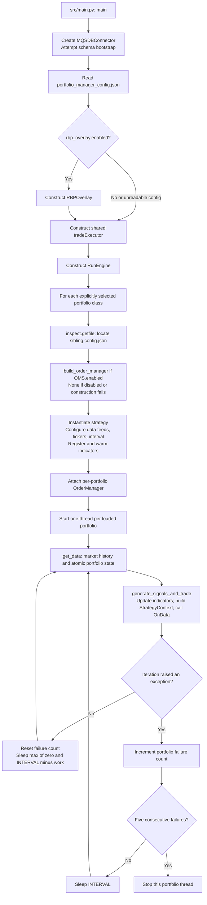
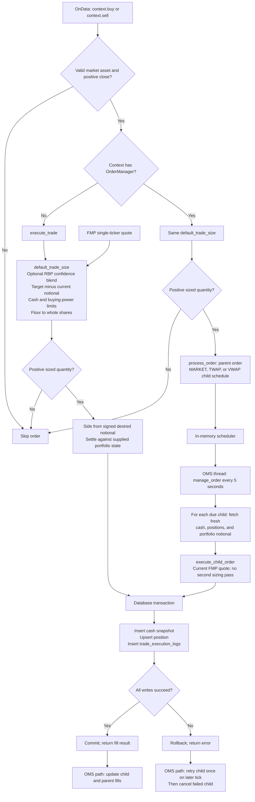

# Inside the live trading bot

[Full launcher lifecycle](live_trading_workflow.md) · [Portfolio development](../../src/portfolios/README.md) · [OMS design](../OMS/OMS_DESIGN.md)

The bot entrypoint is [src/main.py](../../src/main.py). It selects `VolMomentum` (P1) and `MomentumStrategy` (P2), opens one DB connector, constructs one shared `tradeExecutor`, and passes both to one `RunEngine`.

## Initialization and portfolio polling

Unreadable/missing configs and constructor errors skip the affected portfolio. Schema bootstrap errors in `main.py` are logged and execution continues; this is not a guarantee that the schema is usable. If no portfolios load, the engine exits. A successful poll resets the circuit breaker. Errors swallowed inside a strategy/executor do not count as exceptions at the engine boundary.

## Signal, sizing, and settlement

Both execution routes use the **sign of desired notional** for the actual side. A BUY signal can trim an overweight position and therefore execute a SELL. The live executor's `get_current_price` requests an FMP single-ticker quote; the strategy's arrival price comes from its market-data context. Missing/invalid execution quotes cause the trade to be skipped or the child execution to fail.

The shared live executor must not hold mutable per-portfolio OMS state. Each portfolio owns its manager, passed through `BasePortfolio` and `StrategyContext`; the OMS pump supplies an execution closure that retrieves books at **fill time**. A portfolio poll snapshot is not reused for later slices.

MARKET/TWAP/VWAP scheduling and the pump are implemented. Orders are tracked in memory; durable order persistence, a VWAP volume-profile provider, and LIMIT/STOP orders remain outside the implemented path. Some strategies call `execute_trade` directly and bypass context OMS routing; see the [portfolio execution exceptions](../../src/portfolios/README.md#execution-paths-and-exceptions).

## State, concurrency, and stopping

`BasePortfolio.ATOMIC_STATE_QUERY` reads positions, cash, and portfolio notional together, with initial-book seeding when needed. Market data is read separately. A consistent read and transactional fill writes do not make the entire read-size-write sequence one serialized transaction.

The engine monitors portfolio-thread liveness. If all stop, or the foreground engine receives KeyboardInterrupt, it stops the OMS pump, attempts to cancel open orders, and joins threads (OMS join is bounded to 30 seconds). The watchdog's SIGTERM is a different path: `src/main.py` does not install a SIGTERM handler, so a market-close termination must not be described as a guaranteed graceful OMS drain. A single portfolio circuit breaker stops its poll thread; queued orders are not automatically cancelled by that event while the shared pump continues.

## Source map

| Responsibility | Source |
|---|---|
| Selected classes, overlay wiring, bootstrap | [main.py](../../src/main.py) |
| Threads, failure counts, OMS tick | [engine.py](../../src/live_trading/engine.py) |
| State and context construction | [BasePortfolio](../../src/portfolios/portfolio_BASE/strategy.py) |
| Context order routing | [order_interface.py](../../src/portfolios/order_interface.py) |
| Sizing and transactional settlement | [executor.py](../../src/live_trading/executor.py) |
| Confidence blend and forecast cache | [rbp_overlay.py](../../src/risk_manager/rbp_overlay.py) |
| Parent/child lifecycle | [order_manager.py](../../src/oms/order_manager.py) |
