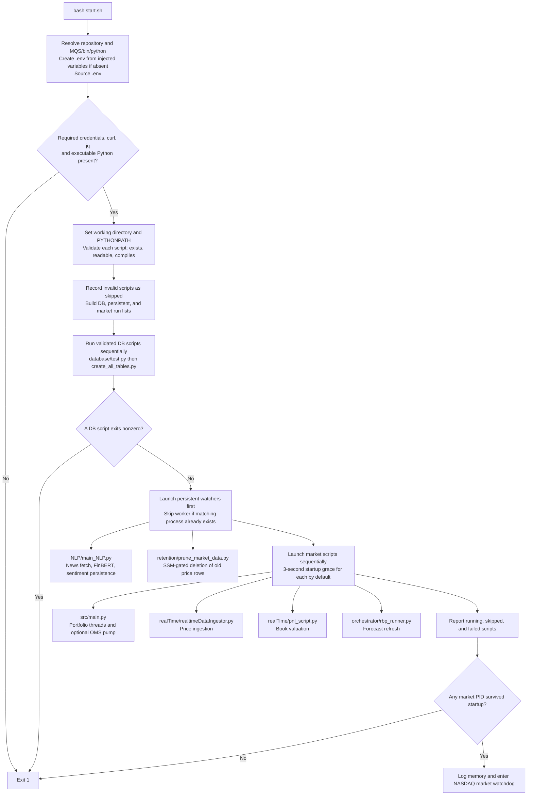
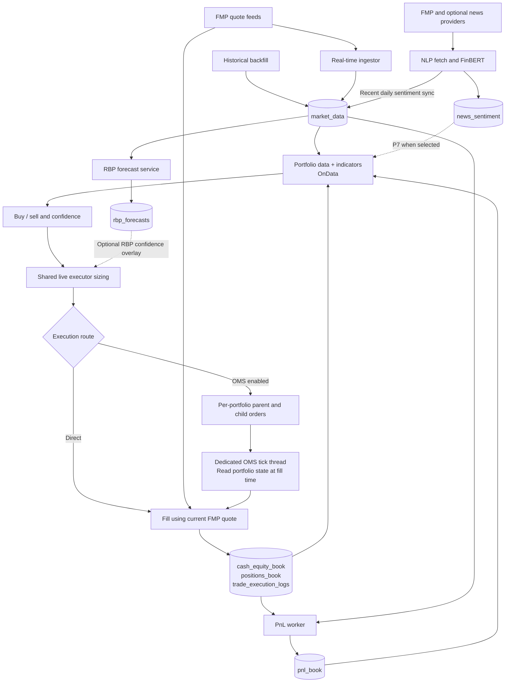
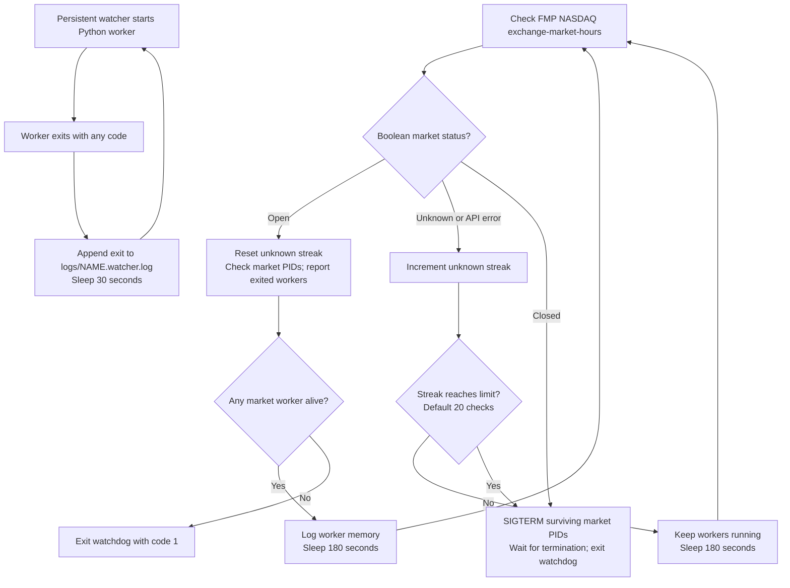

# Live trading stack: from start.sh to shutdown

[Setup and commands](../../README.md) · [Inside the bot](live-trading-workflow_detailed.md) · [Ingestor](realtime-ingestor-workflow.md) · [NLP](nlp_workflow.md)

This is the behavior of the checked-in [start.sh](../../start.sh), including its supporting processes. It describes repository code, not the status of a deployed task.

## Startup and process tree

Missing scripts and syntax failures skip only that script. Import/initialization failures surface in the startup grace check; other workers still launch. DB scripts that return nonzero abort startup, but the current DB helpers can print errors and return zero, so their printed output matters.

**Launch order is not a readiness dependency:** the bot starts before the ingestor. Historical data and initial capital must already be prepared. The first market-hours check occurs **after** workers launch, so starting outside market hours can briefly run the market workers before they are terminated.

## How data reaches the trading books

The live executor records fills in PostgreSQL; this path contains no external broker submission. The RBP overlay is constructed only when the manager config contains `rbp_overlay.enabled: true`; it is absent in the checked-in manager config. NLP is consumed by sentiment-aware strategies such as P7, not automatically by every portfolio. P1 and P2 are the current `src/main.py` selection.

## Market watchdog and persistent-worker lifecycle

Market workers are **not restarted** by the watchdog after a crash. Persistent watchers restart after both successful and failed exits. They start before the market workers, use `nohup`/detachment, and survive normal watchdog exit on a host. A container stopping terminates its remaining processes; these are not independent always-on services merely because they are called persistent.

`start.sh` has no general signal-cleanup trap. Do not treat Ctrl+C on the supervisor as proof that all children stopped. For local development, foreground module commands make process ownership explicit; for a container, stop the container. The `SKIP_PERSISTENT_SCRIPTS` key in `.env.example` is not implemented in this script.

## Process reference

| Worker | Cadence / condition | Output |
|---|---|---|
| Bot | Per-portfolio `INTERVAL`; OMS pump defaults to 5 seconds | Execution and book updates |
| Ingestor | Target 60 seconds including work | `market_data`; stderr and optional file log |
| PnL | Target 60 seconds including work | `pnl_book` |
| RBP runner | Work, then 300-second interruptible sleep | `rbp_forecasts` |
| NLP runner | Target 300 seconds including work; longer sweeps run back-to-back | CSVs, DB sentiment, `logs/daemon.log` |
| Retention | Daily check; minimum 365 days between successful prunes | Deletes price rows older than 545 days by default; records completion in SSM |

Daily capital allocation and historical backfill are separate commands; `start.sh` does not schedule them. Persistent logs are `logs/main_NLP.watcher.log` and `logs/prune_market_data.watcher.log`. The launcher uses Linux `/proc` for duplicate-process checks and memory reporting, so native macOS Bash does not provide its full supervision behavior.
