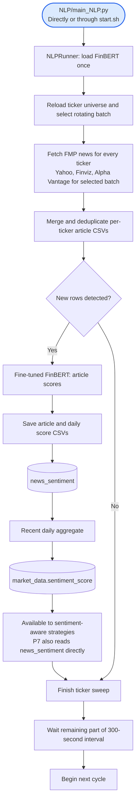

# NLP sentiment: high-level workflow

[Setup and commands](../../NLP/README.md) · [Detailed NLP diagrams](../../NLP/WORKFLOW.md) · [Full live stack](live_trading_workflow.md)

The live loop processes tickers sequentially, rotating alternative-source work through up to four batches. It uses a latest-page FMP fetch for other batches. The historical backfill command uses paginated fetches and blocks startup during weekday cash-session hours. A fetch-only CLI and a local two-model notebook are also available.

The score is positive probability minus negative probability. Persistence uses `news_sentiment`, while the market-data sync updates only the last seven days of matching sentiment. The root setup documents the required `market_data.sentiment_score` column, which differs from the base schema's `avg_sentiment`.

NLP enriches data; it does not place trades. The current live entrypoint runs P1/P2, not P7. See the [detailed workflow](../../NLP/WORKFLOW.md) for exact source selection, model label assumptions, positional CSV alignment, retry behavior, and database requirements.
