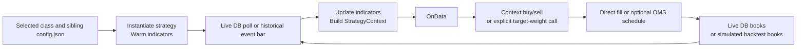

# Portfolio / strategy flow

The detailed guide is maintained beside the strategy code: [src/portfolios/README.md](../../src/portfolios/README.md).

It includes configuration and activation, all available strategies, indicator warmup, the shared live/event lifecycle, context-to-OMS routing, direct-executor exceptions, and separate P5 and P6/P7/P8 diagrams.

Live portfolios share one executor across threads; event backtests have separate executors per portfolio. Fast backtests use vector adapters. Strategies with custom direct-executor calls do not automatically use OMS merely because their config enables it.

Related: [live engine detail](live-trading-workflow_detailed.md), [backtest flow](backtest-flow.md), [NLP detail](../../NLP/WORKFLOW.md), [RBP detail](../../RBP/README.md).
