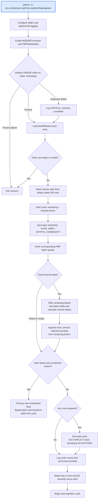
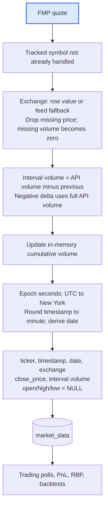

# Real-time market-data ingestor

[Local setup](../../src/orchestrator/realTime/README.md) · [Full live stack](live_trading_workflow.md) · [Historical data pipeline](data-pipeline.md)

The [ingestor](../../src/orchestrator/realTime/realtimeDataIngestor.py) polls FMP quote snapshots and inserts rows into `market_data`. It runs as its own process, independently of the bot and NLP.

## Startup and continuous loop

Feed requests are sequential; the loop stops early if every ticker has been matched. A fetch returning `None` is skipped so other feeds can proceed. An unhandled exception reaches the outer handler, logs a critical error, closes DB connections, and ends the worker. The watchdog reports market-worker loss but does not restart it.

## Transformation and persistence

| Input | Stored meaning |
|---|---|
| `symbol`, `price` | `ticker`, `close_price` |
| `timestamp` | Provider quote timestamp rounded to the nearest minute, not collection time |
| `volume` | Rounded interval delta from in-memory cumulative state |
| `exchange` | Provider value, falling back to the feed label |
| Session `open/dayHigh/dayLow` | Not used as minute-bar OHL; stored OHL remains NULL |

These are quote snapshots, not complete OHLCV candles. Historical intraday backfill provides real interval OHL. Duplicate timestamps are ignored, not overwritten, and one symbol is processed at most once per cycle.

## Boundaries that matter

- **Market hours:** the standalone loop has no active market-open guard. `start.sh` owns session shutdown for all its market workers, including crypto and commodity feeds.
- **Restart volume:** the DB stores interval volume, but startup seeds the cumulative tracker from that column. The first delta after a midday restart can therefore overstate volume. Crypto rolling-volume feeds also do not behave like equity session totals.
- **Failed insert:** volume state advances before the bulk insert. A failed transaction does not roll back that in-memory state.
- **Universe:** edits to `tickers.json` require an ingestor restart; portfolio configs do not select its universe.
- **Logs:** stderr always; `/var/log/market_data_ingestor.log` if writable, overridden by `MARKET_DATA_INGESTOR_LOG`. Logs distinguish prepared/inserted/ignored rows, failed feeds, and uncovered symbols. Missing symbols are named on cycle 1 and every 30 cycles.
- **Request budget:** the shared code defines a per-process realtime limiter of 1000 requests/minute. Up to five batch-feed calls occur in a normal cycle, before client retries; this is not an account-wide cross-process limiter.
