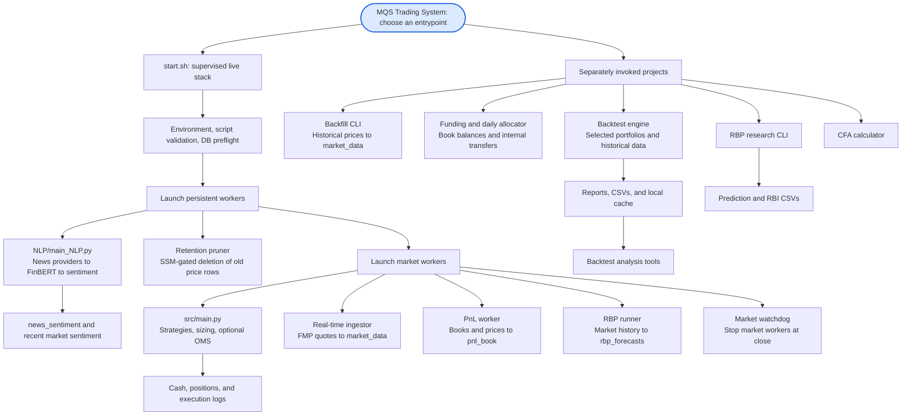

# System architecture

[Setup](../../README.md) · [Workflow index](README.md)

Read this hierarchy from the root downward. The live stack starts at `start.sh`; the other project entrypoints form a separate branch because the launcher does not run them. Detailed workflow pages show the data exchanged between these components.

## Ownership and execution boundaries

| Component | Main responsibility |
|---|---|
| `src/live_trading/` | Threaded strategy execution with a shared DB-backed executor |
| `src/backtest/` | Per-portfolio simulation and fast vector adapters |
| `src/portfolios/` | Signals, indicators, strategy-specific target construction |
| `src/oms/` | Config-gated, per-portfolio in-memory parent/child order scheduling |
| `src/orchestrator/` | Price ingestion, historical backfill, RBP refresh, retention |
| `NLP/` | News scraping, FinBERT inference, sentiment persistence, local experiments |
| `RBP/` | Relevance-based research prediction and forecast service |
| `src/risk_manager/` | Funding, capital allocation, drawdown controls, optional RBP sizing overlay |
| `scripts/` | Analysis, API utilities, and CFA calculator |

The live executor settles fills in PostgreSQL. Backtests do not prove the live path ran. P1/P2 are selected by the live entrypoint; other strategies and optional overlays require explicit selection/configuration. The price, NLP, and RBP workers have different universe-selection rules, described in their guides.

See [launcher lifecycle](live_trading_workflow.md) for which workers survive market close and how container lifetime limits persistent processes. The production deployment must be checked separately from this code map.
