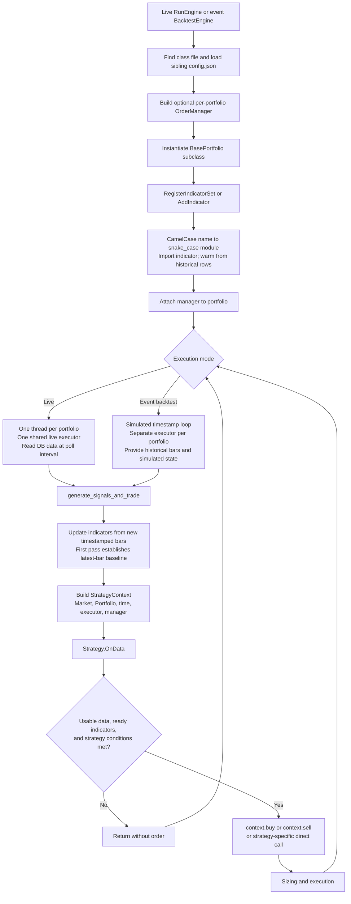
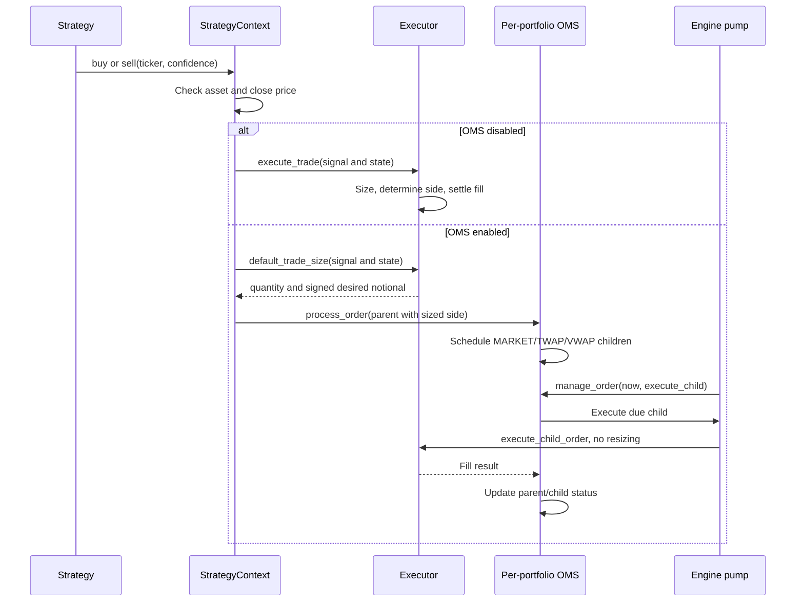
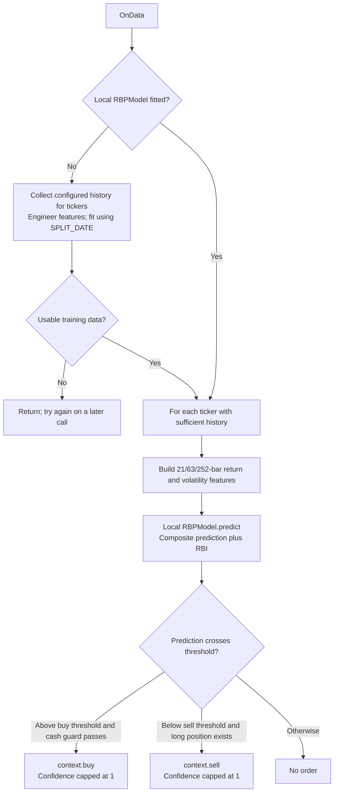
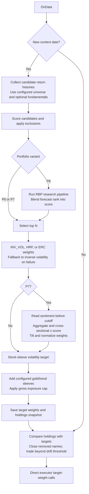

# Portfolios: setup and detailed workflow

[Repository setup](../../README.md) · [Live engine](../../docs/workflows/live-trading-workflow_detailed.md) · [Backtest engine](../../docs/workflows/backtest-flow.md) · [RBP](../../RBP/README.md)

Each strategy folder contains `strategy.py` and a sibling `config.json`. The engine finds the config using the strategy class's **file location**. Strategies run through an engine; executing a strategy file directly is not the supported runner.

## Configure and run

1. Complete the root Windows/macOS setup, configure a development DB, initialize tables, and load price history covering the configured tickers and warmup.
2. Edit the strategy's own config: `PORTFOLIO_ID`, `TICKERS`, `INTERVAL`, `LOOKBACK_DAYS`, `DATA_FEEDS`, strategy-specific settings, and optional `OMS`.
3. For live execution, import/select the class in [src/main.py](../main.py)'s `portfolio_classes`. Its current list is P1/P2. Start the price ingestor and PnL worker, and initialize the relevant portfolio capital.
4. For backtests, select classes in [src/main_backtest.py](../main_backtest.py), set the dates/capital and `BACKTEST_MODE`, then run the appropriate command:

```bash
python -m src.main_backtest
python -m src.main
```

Choose one command for the intended mode. Live uses database books; event backtests use per-portfolio simulated books. Fast mode uses vector adapters and does not replay this `OnData` lifecycle.

[portfolio_manager_config.json](portfolio_manager_config.json) contains **capital shares**, not strategy discovery. It also controls the RBP forecast universe through positive weights. Adding a weight does not import or start the corresponding strategy.

## Available strategies

| Folder / class | Main behavior | Execution route |
|---|---|---|
| [portfolio_1](portfolio_1/strategy.py) / `VolMomentum` | Volume and momentum signals | Context buy/sell |
| [portfolio_2](portfolio_2/strategy.py) / `MomentumStrategy` | Momentum indicators and graded confidence | Context buy/sell |
| [portfolio_3](portfolio_3/strategy.py) / `RegimeAdaptiveStrategy` | Regime-aware decisions with VIX and custom tradeable weights | Custom context construction and direct executor |
| [portfolio_4](portfolio_4/strategy.py) / `TrendRotateStrategy` | Trend rotation | Context buy/sell |
| [portfolio_5](portfolio_5/strategy.py) / `RBPStrategy` | Local RBP model, return thresholds, cash guard | Context buy/sell |
| [portfolio_6](portfolio_6/strategy.py) / `Portfolio6Strategy` | Screen universe, select names, weight and rebalance | Direct target-weight executor calls |
| [portfolio_7](portfolio_7/strategy.py) / `Portfolio7Strategy` | P6-style construction plus sentiment weight tilt | Inherits P6 order submission |
| [portfolio_8](portfolio_8/strategy.py) / `Portfolio8Strategy` | P6-style construction plus RBP ranking | Inherits P6 order submission |
| [portfolio_dummy](portfolio_dummy/strategy.py) / `CrossoverRmiStrategy` | Crossover/RMI example strategy | Context buy/sell |

Presence in this table does not imply default live activation. P6/P7/P8 require their universe and longer history; P7 needs sentiment data/schema, and P8 uses the RBP research package. They are available in the backtest entrypoint's class catalog but are not in its default class list.

## Shared lifecycle



`BasePortfolio` updates all newly observed bars in timestamp order after its baseline. Strategies still receive `OnData` calls on polls without new rows; each strategy decides whether to act. The live data path reads market data separately from the atomic cash/positions/notional snapshot. Indicator warmup is distinct from the first poll.

## Context order routing



The live pump runs in a dedicated thread (default five-second tick) and loads fresh portfolio state for every child. The event backtest pump runs against simulated bar time. Execution direction follows **signed desired notional**, not the original BUY/SELL label.

### Execution paths and exceptions

The diagram above is the shared context route, not a guarantee for every custom strategy:

- P3 overrides context construction and directly calls `context._executor.execute_trade` through `_execute_order`. Its calls bypass context OMS routing.
- P6/P7/P8 use `_issue_target` to call `self.executor.execute_trade` directly with an explicit target weight. They also bypass the context OMS path.
- P6's direct call currently passes `positions=None`. The live executor expects a positions DataFrame during sizing, so these strategies need live-path validation before adding them to the production class list; event-backtest behavior is not proof of live compatibility.
- Fast backtests use separate vector adapters. Their results are not evidence that context routing or live OMS scheduling executed.
- Import style matters: mixing `portfolios.*` and `src.portfolios.*` can create distinct Python class identities. Match surrounding imports; OMS imports are `src.oms.*`.

## RBP strategy (P5)



P5 uses [portfolio_5/rbp_model.py](portfolio_5/rbp_model.py), not the forecast worker's `rbp_forecasts` table. Its feature names say days, but windows count rows in the supplied history; minute bars are not automatically resampled by this local model. The [RBP guide](../../RBP/README.md) distinguishes all three integrations.

## Screened portfolios (P6, P7, P8)



P7 can fall back from article-level sentiment to market-data sentiment when configured; missing/insufficient sentiment gives neutral treatment according to its thresholds. P8 falls back to base screening when forecasts fail, and its current research output uses a task-average fallback when ticker identity is missing (see the RBP guide). Volatility targeting belongs to the stock sleeve, not a second master-level volatility rescale.

## Adding or changing a strategy

Keep implementation and its config together. Subclass `BasePortfolio`, register indicators in initialization, and implement `OnData(context)`. Access prices through `context.Market[ticker]`, history through `asset.History(...)`, and books through `context.Portfolio`. Prefer context buy/sell for strategies that should participate in OMS routing.

Select the new class explicitly in the appropriate entrypoint. Add capital weights separately if required. Exercise the strategy in event backtests with sufficient warmup, and verify its actual order route before enabling live execution. Tests that need no external services can follow the monkeypatched patterns in [test_trade_executor_constraints.py](../../tests/test_trade_executor_constraints.py); tag new tests with registered markers.

Key framework files: [BasePortfolio](portfolio_BASE/strategy.py), [StrategyContext](order_interface.py), [MarketData](market_data_api.py), [PortfolioManager](portfolio_interface.py), and [indicator base](indicators/base.py).
