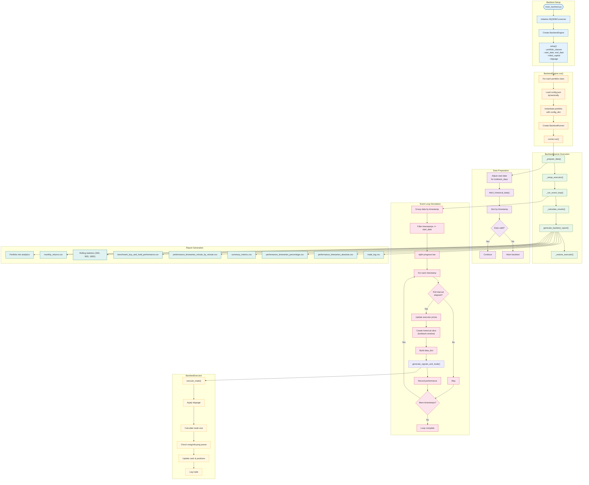

# Backtesting Workflow

Complete flow of the backtesting engine from setup to report generation.

## Backtest Output Files

| File | Description |
|------|-------------|
| `trade_log.csv` | All executed trades with timestamps, prices, quantities |
| `performance_timeseries_absolute.csv` | Portfolio value over time |
| `performance_timeseries_percentage.csv` | Returns as percentages |
| `summary_metrics.csv` | Final value, max drawdown, Sharpe ratio |
| `performance_timeseries_minute_by_minute.csv` | High-frequency performance |
| `benchmark_buy_and_hold_performance.csv` | Buy-and-hold comparison |
| `30D_Rolling.csv`, `90D_Rolling.csv`, `180D_Rolling.csv` | Rolling statistics |
| `monthly_returns.csv` | Monthly return breakdown |
| `portfolio_risk_components.csv` | Individual asset volatilities |
| `annualized_correlation_matrix.csv` | Asset correlations |
| `rolling_portfolio_risk.csv` | Rolling portfolio volatility |

## Key Metrics Calculated

- **Max Drawdown**: Peak-to-trough decline
- **Sharpe Ratio**: Annualized risk-adjusted return (√252 factor)
- **Rolling Statistics**: Mean return and volatility over windows
- **Monthly Returns**: Resampled end-of-month returns
