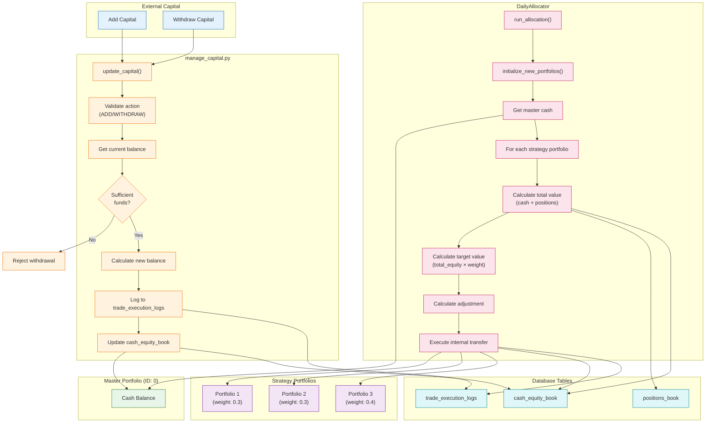
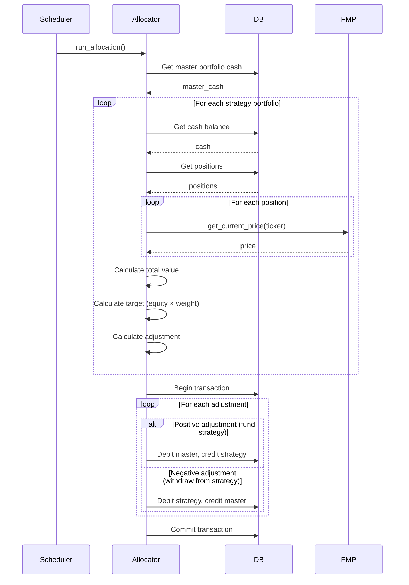
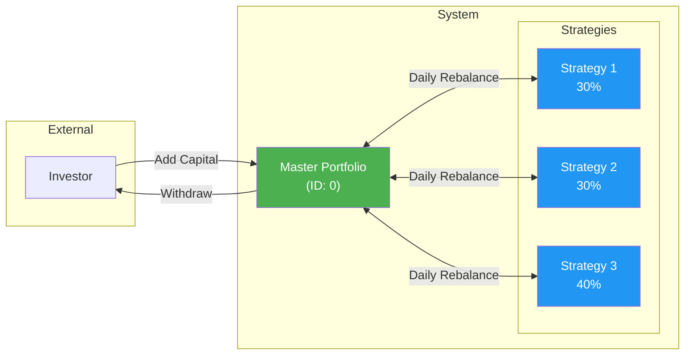

# Capital Management Workflow

Risk management, capital allocation, and fund transfers between portfolios.



## Daily Allocation Sequence



## Configuration Schema

```json
{
  "master_portfolio_id": "0",
  "currency": "USD",
  "portfolio_weights": {
    "1": 0.30,
    "2": 0.30,
    "3": 0.40
  }
}
```

## Internal Transfer Recording

Each internal transfer creates two entries in `trade_execution_logs`:

| Field | From Portfolio | To Portfolio |
|-------|----------------|--------------|
| ticker | USD_CASH | USD_CASH |
| side | SELL | BUY |
| quantity | amount | amount |
| arrival_price | 1.0 | 1.0 |
| exec_price | 1.0 | 1.0 |

## Capital Flow Diagram



## CLI Usage

```bash
# Add capital to master portfolio
python -m src.risk_manager.manage_capital --action ADD --amount 100000

# Withdraw capital from master portfolio
python -m src.risk_manager.manage_capital --action WITHDRAW --amount 50000

# Run daily allocation (typically scheduled)
python -m src.risk_manager.daily_allocator
```
