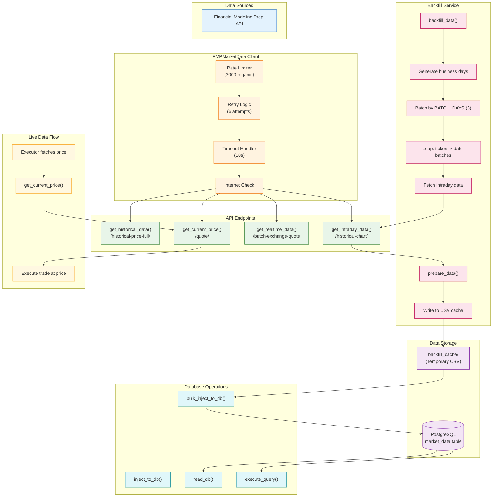
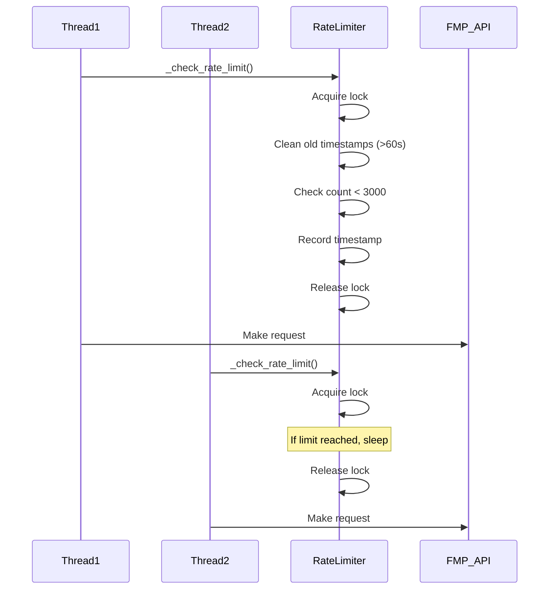

# Data Pipeline Workflow

Market data ingestion, backfill, and storage pipeline.

## Rate Limiting Strategy

## Data Schema

### market_data Table
| Column | Type | Description |
|--------|------|-------------|
| ticker | VARCHAR | Stock symbol |
| timestamp | TIMESTAMP | Bar timestamp |
| open_price | DECIMAL | Opening price |
| high_price | DECIMAL | High price |
| low_price | DECIMAL | Low price |
| close_price | DECIMAL | Closing price |
| volume | BIGINT | Trading volume |

## Backfill Configuration

| Parameter | Default | Description |
|-----------|---------|-------------|
| BATCH_DAYS | 3 | Days per API call |
| MAX_RETRIES | 6 | Retry attempts |
| TIMEOUT_SECONDS | 10 | Request timeout |
| MAX_REQUESTS_PER_MIN | 3000 | Rate limit |
