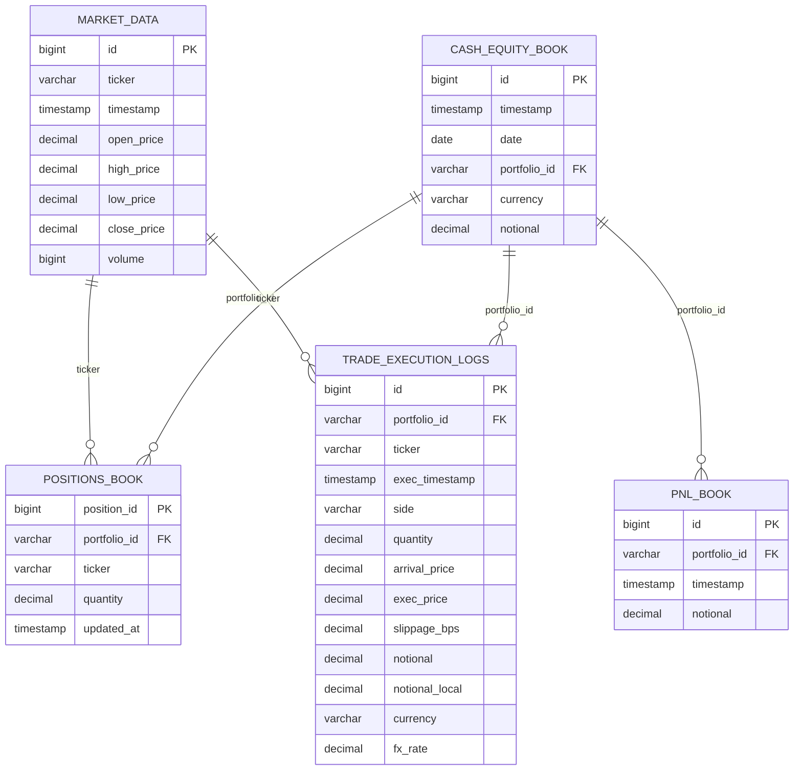
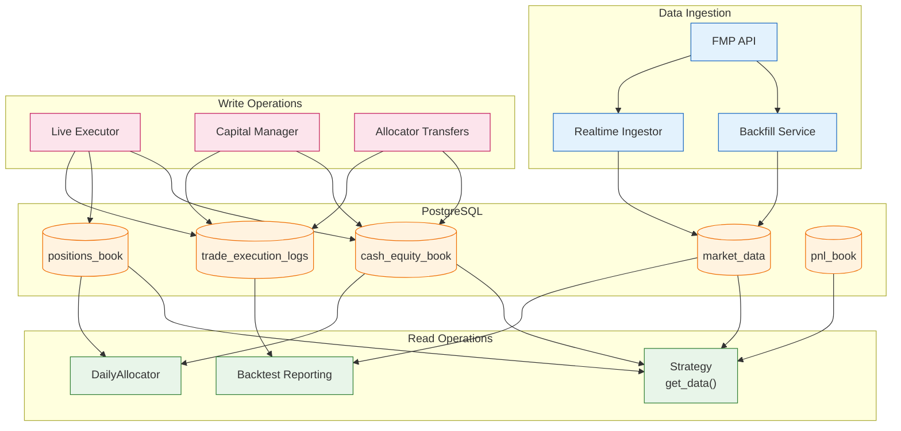
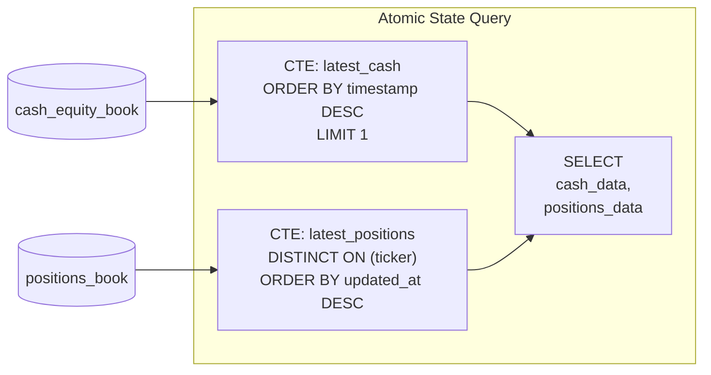
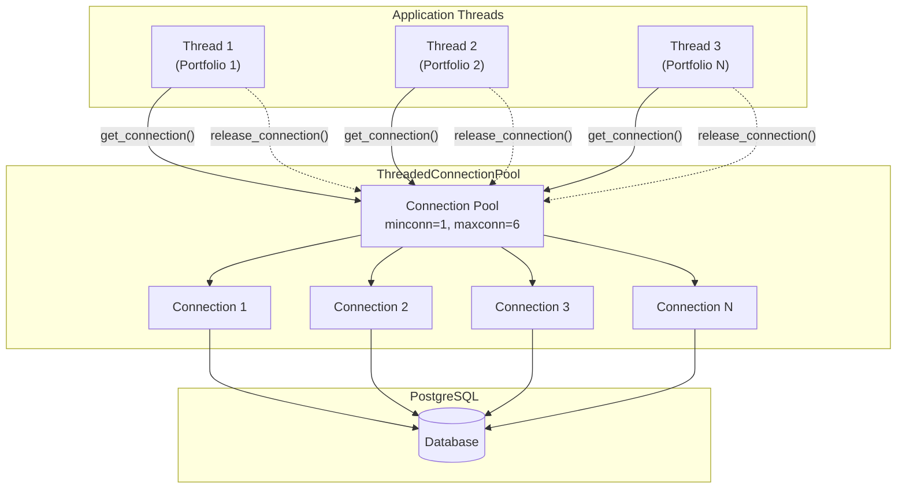

# Database Schema & Data Flow

Entity relationships and data flow through the PostgreSQL database.



## Data Flow Diagram



## Atomic State Query

The system uses a single atomic query to fetch consistent portfolio state:



## Connection Pool Architecture



## Key Queries

### Fetch Latest Cash
```sql
SELECT notional FROM cash_equity_book 
WHERE portfolio_id = %s 
ORDER BY timestamp DESC LIMIT 1;
```

### Fetch Latest Positions
```sql
SELECT DISTINCT ON (ticker) 
    position_id, portfolio_id, ticker, quantity, updated_at
FROM positions_book
WHERE portfolio_id = %s
ORDER BY ticker, updated_at DESC;
```

### Fetch Market Data
```sql
SELECT * FROM market_data
WHERE ticker IN ({placeholders})
  AND timestamp BETWEEN %s AND %s;
```

### Bulk Insert with Conflict Handling
```sql
INSERT INTO {table} ({columns}) VALUES %s
ON CONFLICT ({conflict_columns}) DO NOTHING;
```
