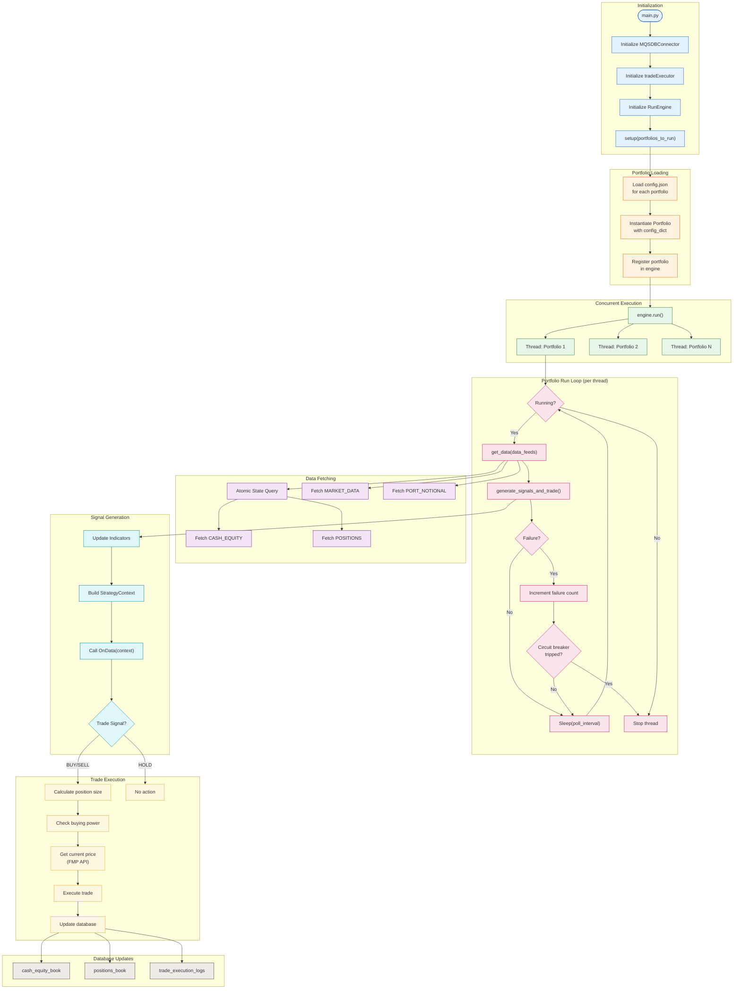

# Live Trading Workflow

Detailed flow of the live trading system from initialization to trade execution.

## Key Features

### Circuit Breaker Pattern
- Tracks consecutive failures per portfolio
- Stops portfolio thread after `max_consecutive_failures` (default: 5)
- Prevents cascading failures from affecting other portfolios

### Thread Safety
- Each portfolio runs in its own thread
- Database connector uses connection pooling
- FMPMarketData has thread-safe rate limiting

### Margin Model
- Supports long and short positions
- Configurable leverage (default: 2.0x)
- Buying power calculation mirrors live trading constraints
