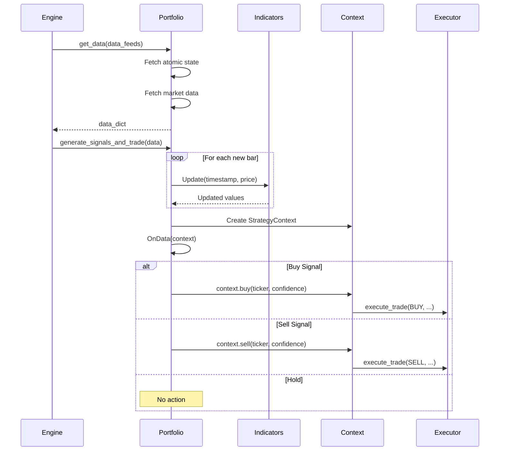

# Portfolio Strategy Workflow

Strategy signal generation, indicator management, and trade execution flow.

```mermaid
flowchart TD
    subgraph Base["BasePortfolio (Abstract)"]
        INIT["__init__()"]
        GET_DATA["get_data()"]
        GEN_SIGNALS["generate_signals_and_trade()"]
        ON_DATA["OnData() - Abstract"]
    end

    subgraph Indicators["Indicator System"]
        ADD_IND["AddIndicator()"]
        REG_SET["RegisterIndicatorSet()"]
        IND_FACTORY["Dynamic Factory<br/>(importlib)"]
        WARMUP["Indicator Warmup<br/>(historical data)"]
    end

    subgraph IndicatorTypes["Available Indicators"]
        SMA["SimpleMovingAverage"]
        RSI["RelativeStrengthIndex"]
        RMI["RelativeMomentumIndex"]
        ATR["AverageTrueRange"]
        DMA["DisplacedMovingAverage"]
        ROC["RateOfChange"]
        VWAP["VWAP"]
    end

    subgraph Context["StrategyContext API"]
        CTX_INIT["StrategyContext()"]
        MARKET["Market<br/>(MarketData)"]
        PORTFOLIO["Portfolio<br/>(PortfolioManager)"]
        TIME["time"]
        BUY["buy(ticker, confidence)"]
        SELL["sell(ticker, confidence)"]
    end

    subgraph MarketAPI["MarketData API"]
        ASSET["Market[ticker]<br/>→ AssetData"]
        OHLCV["Open, High, Low,<br/>Close, Volume"]
        HISTORY["History(lookback)"]
        EXISTS["Exists"]
    end

    subgraph PortfolioAPI["PortfolioManager API"]
        CASH["cash"]
        TOTAL["total_value"]
        POSITIONS["positions"]
        GET_VALUE["get_asset_value()"]
        GET_WEIGHT["get_asset_weight()"]
    end

    subgraph Execution["Trade Execution"]
        TRADE["_trade()"]
        VALIDATE["Validate market data"]
        EXEC_CALL["executor.execute_trade()"]
    end

    %% Base flow
    INIT --> ADD_IND
    INIT --> REG_SET
    GET_DATA --> GEN_SIGNALS
    GEN_SIGNALS --> CTX_INIT
    CTX_INIT --> ON_DATA

    %% Indicator flow
    ADD_IND --> IND_FACTORY
    REG_SET --> IND_FACTORY
    IND_FACTORY --> WARMUP
    WARMUP --> SMA
    WARMUP --> RSI
    WARMUP --> RMI
    WARMUP --> ATR
    WARMUP --> DMA
    WARMUP --> ROC
    WARMUP --> VWAP

    %% Context composition
    CTX_INIT --> MARKET
    CTX_INIT --> PORTFOLIO
    CTX_INIT --> TIME
    CTX_INIT --> BUY
    CTX_INIT --> SELL

    %% Market API
    MARKET --> ASSET
    ASSET --> OHLCV
    ASSET --> HISTORY
    ASSET --> EXISTS

    %% Portfolio API
    PORTFOLIO --> CASH
    PORTFOLIO --> TOTAL
    PORTFOLIO --> POSITIONS
    PORTFOLIO --> GET_VALUE
    PORTFOLIO --> GET_WEIGHT

    %% Execution
    BUY --> TRADE
    SELL --> TRADE
    TRADE --> VALIDATE
    VALIDATE --> EXEC_CALL

    %% Styling
    classDef base fill:#e3f2fd,stroke:#1565c0
    classDef indicator fill:#fff3e0,stroke:#ef6c00
    classDef indtype fill:#e8f5e9,stroke:#2e7d32
    classDef context fill:#fce4ec,stroke:#c2185b
    classDef market fill:#f3e5f5,stroke:#7b1fa2
    classDef portfolio fill:#e0f7fa,stroke:#00838f
    classDef exec fill:#fff8e1,stroke:#f9a825

    class INIT,GET_DATA,GEN_SIGNALS,ON_DATA base
    class ADD_IND,REG_SET,IND_FACTORY,WARMUP indicator
    class SMA,RSI,RMI,ATR,DMA,ROC,VWAP indtype
    class CTX_INIT,MARKET,PORTFOLIO,TIME,BUY,SELL context
    class ASSET,OHLCV,HISTORY,EXISTS market
    class CASH,TOTAL,POSITIONS,GET_VALUE,GET_WEIGHT portfolio
    class TRADE,VALIDATE,EXEC_CALL exec
```



## Strategy Implementation Pattern



## Indicator Registration Example

```python
# In strategy __init__:
self.RegisterIndicatorSet({
    "fast_sma": ("SimpleMovingAverage", {"period": 10}),
    "slow_sma": ("SimpleMovingAverage", {"period": 30}),
    "rsi": ("RelativeStrengthIndex", {"period": 14})
})

# Usage in OnData:
def OnData(self, context):
    for ticker in self.tickers:
        fast = self.fast_sma[ticker].Value
        slow = self.slow_sma[ticker].Value
        rsi = self.rsi[ticker].Value
        
        if fast > slow and rsi < 70:
            context.buy(ticker, confidence=0.8)
```

## Trade Sizing Model

| Parameter | Description |
|-----------|-------------|
| `ticker_weight` | Target allocation from config |
| `confidence` | Signal strength (0.0 - 1.0) |
| `port_notional` | Total portfolio value |
| `target_notional` | `port_notional × ticker_weight` |
| `adjustment` | `target_notional - current_value` |
| `trade_notional` | `adjustment × confidence` |
