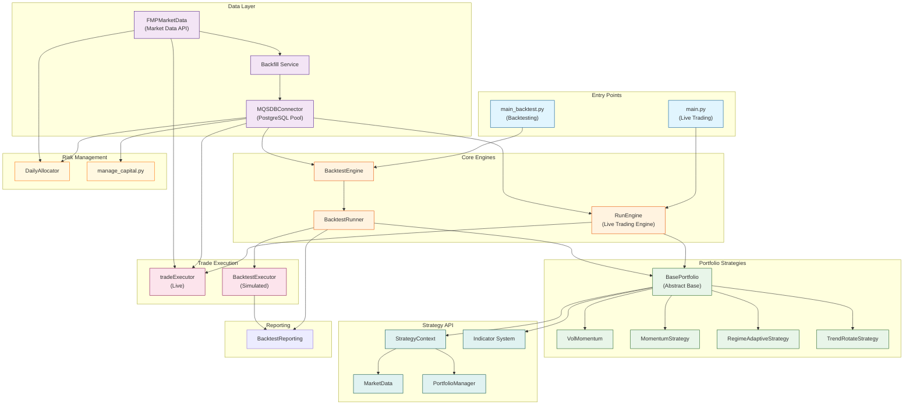

# System Architecture Overview

High-level architecture of the MQS Trading System showing all major components and their relationships.

## Component Descriptions

| Component | Location | Purpose |
|-----------|----------|---------|
| RunEngine | `src/live_trading/engine.py` | Manages concurrent portfolio execution for live trading |
| BacktestEngine | `src/backtest/backtest_engine.py` | Orchestrates backtest configuration and execution |
| BacktestRunner | `src/backtest/runner.py` | Runs event-driven backtest simulation |
| tradeExecutor | `src/live_trading/executor.py` | Executes real trades via API and updates database |
| BacktestExecutor | `src/backtest/executor.py` | Simulates trade execution with margin model |
| BasePortfolio | `src/portfolios/portfolio_BASE/strategy.py` | Abstract base class for all strategies |
| MQSDBConnector | `src/common/database/MQSDBConnector.py` | Thread-safe PostgreSQL connection pool |
| FMPMarketData | `src/orchestrator/marketData/fmpMarketData.py` | Financial Modeling Prep API client |
